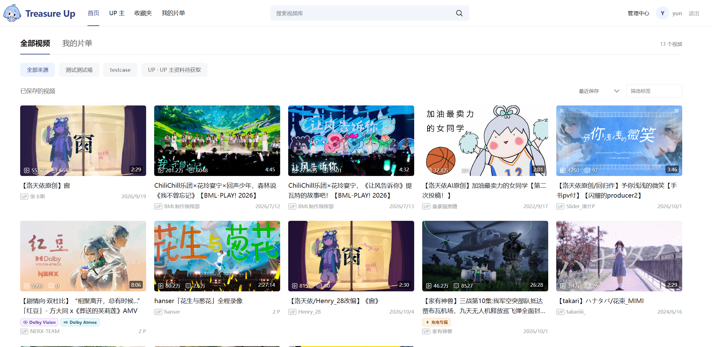
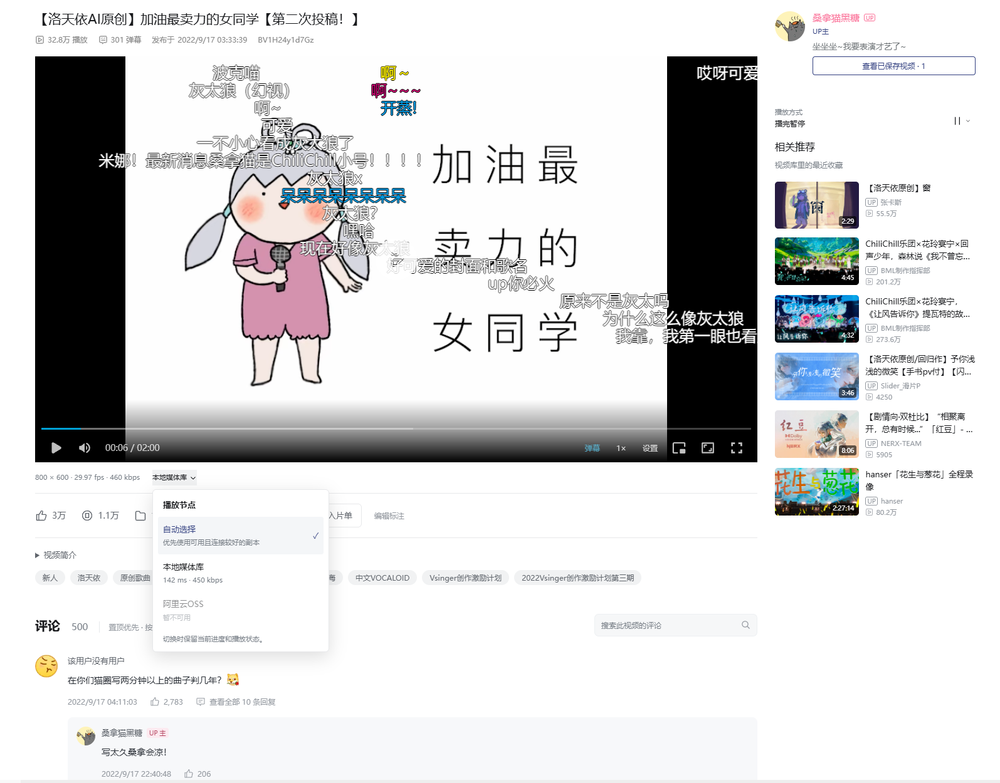
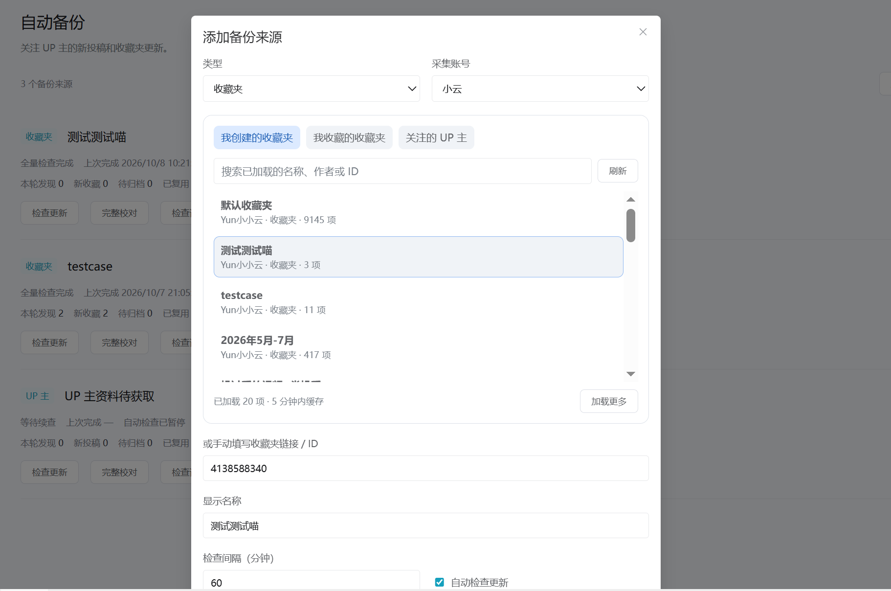
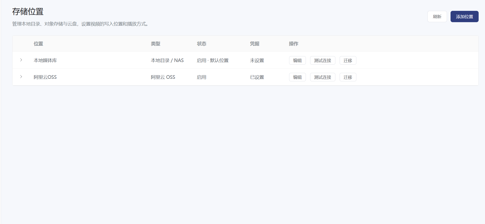
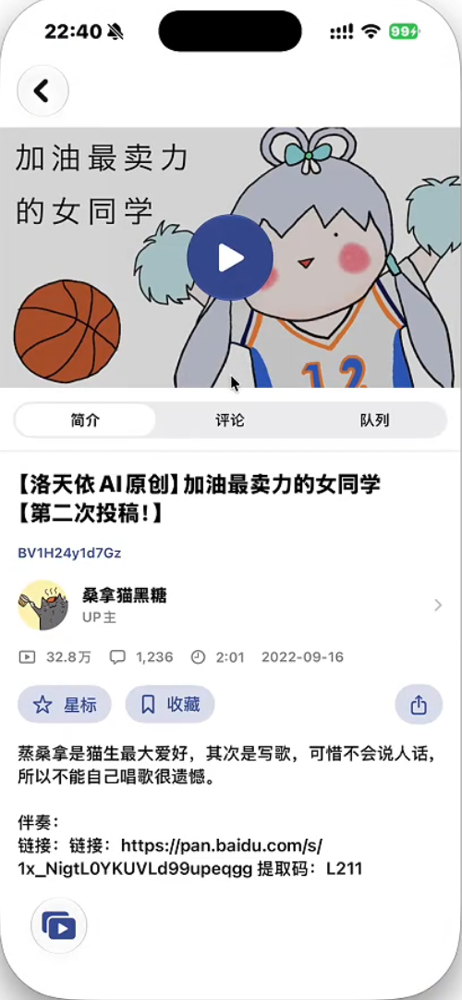
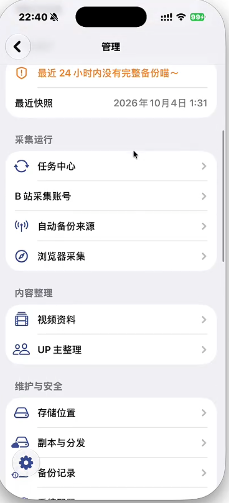

<p align="center"></p>
<p align="center"><b>一个 B 站视频归档库</b></p>

## 前言

你是否遇到过这些问题？

- 给 UP 主付费后看的充电视频，想重温时发现包月刚刚到期。
- 视频不可抗因素被删除了，找到了补档，却找不回原来的弹幕和评论。
- 担心叔叔压画质码率，想留住现在能看到的版本。

Treasure Up 可以把视频保存起来，连同弹幕、评论和作者资料一起留下，随时观看。

## ✨ 亮点

- 备份收藏夹、UP 主投稿，定时发现新视频；也支持用油猴脚本勾选采集。
- 保存封面、标签、作者资料、弹幕、评论及置顶评论，更新视频统计和失效状态。
- 支持多 P、充电视频、杜比视界和杜比全景声，提供分片播放与兼容音轨。
- 支持本地、阿里云OSS、腾讯云COS、又拍云、七牛、S3 兼容存储、OneDrive 和 SharePoint，可同步副本、切换播放节点。
- 支持搜索、播放列表、星标、弹幕设置和备份恢复。

## 预览

<table>
    <tr>
        <td width="50%" align="center">
            <strong>视频库首页</strong><br /><br />
            
        </td>
        <td width="50%" align="center">
            <strong>采集视频预览</strong><br /><br />
            
        </td>
    </tr>
    <tr>
        <td width="50%" align="center">
            <strong>多来源采集视频</strong><br /><br />
            
        </td>
        <td width="50%" align="center">
            <strong>多存储源</strong><br /><br />
            
        </td>
    </tr>
    <tr>
        <td width="50%" align="center">
            <strong>ios视频页</strong><br /><br />
            
        </td>
        <td width="50%" align="center">
            <strong>ios后台管理</strong><br /><br />
            
        </td>
    </tr>
</table>


## 快速开始

先安装并启动 Docker，Compose 需为 **2.34 或更新版本**。

```sh
docker compose -f oci://docker.io/yunyunjuan/treasure-up:latest up -d
```

Compose 直接从 Docker Hub 读取部署配置、拉取镜像并启动服务，无需下载源码。首次运行会自动生成密码和密钥。

在自己的终端查看初始账号：

```sh
docker compose -f oci://docker.io/yunyunjuan/treasure-up:latest run --rm setup --show-login
```

打开 **<http://localhost:8788>** 登录。

也可以[下载单个 compose.yaml](https://github.com/guoweiyi/treasure-up/releases/latest/download/compose.yaml)，在文件所在目录执行 `docker compose up -d`，再用 `docker compose run --rm setup --show-login` 查看账号。

<details>
<summary>部署在 NAS，或需要从其他设备访问</summary>

下载上面的 `compose.yaml`，在同一目录新建 `.env`，填入实际地址：

```dotenv
TREASURE_PUBLIC_ORIGIN=http://192.168.1.20:8788
TREASURE_BIND_ADDRESS=0.0.0.0
```

然后执行 `docker compose up -d`。使用反向代理时，把地址改为实际 HTTPS 域名；iOS App 和通行密钥登录请使用 HTTPS。

</details>

登录后，在后台添加 B 站账号、存储位置和备份来源。[升级或迁移已有部署](docs/installation.md#升级与数据)时保留原配置和数据卷。

## iPhone / iPad

从 [Releases](https://github.com/guoweiyi/treasure-up/releases) 下载 `ios-unsigned.ipa` 附件，按[自签名指引](native/apple/INSTALL.md)安装。首次打开填写自己的服务器地址并登录。支持 iOS / iPadOS 18 及以上。

## 文档

- [安装、升级与反向代理](docs/installation.md)
- [开发](docs/development.md) · [手动发版](docs/publishing.md) · [iOS 工程](native/README.md)

技术栈：Vue 3 / TypeScript、FastAPI、PostgreSQL、Celery / Redis、FFmpeg、SwiftUI。

## 致谢

播放器使用 [Artplayer](https://github.com/zhw2590582/ArtPlayer) 及其弹幕插件，视频下载使用 [yt-dlp](https://github.com/yt-dlp/yt-dlp)。
