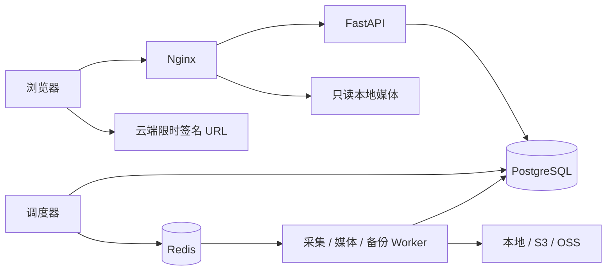

# 部署与维护

本文对应当前 0.3 技术预览。默认部署用于本人本机或受保护内网；默认必须登录，管理员可在系统配置中开启游客浏览，管理功能始终须授权。公网发布另行验收 HTTPS 与对象存储访问策略。

## 服务与数据

`web` 提供静态页面、API 反向代理和本地 Range 文件分发，其媒体挂载保持只读。`api` 处理管理员即时存储探测，因此媒体目录可写；探测只创建随机名称的小文件并在结束时清理。`collector` 负责来源查询、评论与人员采集；`download-worker` 下载媒体；`media-worker` 处理兼容副本、分片与迁移；`backup-worker` 独立持有备份密钥。`scheduler` 从数据库任务和 outbox 投递消息，Redis 不是唯一任务记录。



Compose 持久卷：`database` 数据库、`media` 内容寻址资产、`scratch` 下载及处理中间文件、`queue` Redis、`backup` 加密备份。`scratch` 不是归档；不要根据它判断备份是否成功。

```bash
docker compose ps
docker compose logs --tail=100 api collector download-worker media-worker backup-worker scheduler
docker compose stop
docker compose start
```

不要粘贴包含账号信息的完整日志。镜像版本、Python 和 npm 依赖均固定于提交；升级依赖需重新验证来源适配器与备份恢复。

## 初次配置

1. 用 `python deploy/start.py` 启动，首次在交互式终端显示管理员密码；也可在本机 `.env` 查看。访问 `http://localhost:8788`。后台可创建编辑或只读账号。
2. 在采集账号页选择「扫码添加账号」，用哔哩哔哩 App 确认；也可手动填写 Cookie 和配套刷新令牌。服务端使用 `TREASURE_SECRET_KEY` 加密保存，不回显凭据。手动添加后的账号「验证」是异步任务，只有成功结果才代表登录验证通过。
3. 设置存储位置、默认位置和系统采集策略。
4. 在“自动备份”选择采集账号，加载自己创建 / 已收藏的收藏夹或关注 UP 列表，也支持已知 B 站链接和纯 ID 解析名称。关注列表沿用源站最常访问排序，分页按需加载，缓存 5 分钟。选择首次处理策略，核对自动检查开关后保存；也可关闭开关先手动检查。任务不会从网站播放操作中触发。
5. 观察任务和 capture 状态。遇到登录失效、风控、权限不足应更新凭据或暂停处理，系统不会绕过验证。

来源策略覆盖系统策略，任务入队时固定策略快照，派生下载任务沿用同一快照。`request_budget` / `max_pages` 控制一轮处理量，未遍历完会留下 checkpoint；这不是“请求额度用完就宣告全量成功”。预算主要按页和分段计数，不等于每一个 HTTP 请求的精确计数。

轻量模式用 `python deploy/start.py --light`，恢复完整模式用 `python deploy/start.py`。脚本先等待新 Worker 回报本节点的指定任务队列就绪，再停止旧模式的下载 / 媒体 Worker；新服务不健康时不会执行停用步骤。检查有最长等待时间，失败后保留配置和数据卷，查看状态再重试。

## B 站授权与自动续期

扫码授权同时取得 Cookie 和独立刷新令牌；手动表单接受 `refresh_token` / `ac_time_value`，需与同一次登录的 Cookie 配套。仅有 Cookie 时不安排自动续期。正常每 24 小时检查，只有 B 站要求刷新时才轮换；账号页可关闭自动续期，也可单次「检查续期」。普通 API 不等待整段续期请求，账号实际风控冷却继续生效。

新凭据先加密落库，再确认旧令牌失效。确认失败只重试确认，连续失败达到 5 次停止自动检查；轮换 POST 的结果未知时必须重新授权，不能反复点击重发。检查账号页的状态、下次检查时间与任务记录；不要把原始 Cookie、刷新令牌、二维码 URL 写进日志或问题报告。完整状态说明及[可复现验证命令](bilibili-session-research.md#可复现验证)见会话文档。

## 使用预构建镜像

GitHub Release 的部署包不包含前后端源码，解压后显式使用 `--prebuilt`。源码检出也支持此模式；默认启动方式仍是本机构建。

```bash
# 完整模式：先拉取所有所需镜像，成功后启动并等待健康检查。
python deploy/start.py --prebuilt
# 资源有限时：元数据与备份仍独立，下载 / 媒体处理共用 Worker。
python deploy/start.py --prebuilt --light
```

源码中的镜像默认值为 `ghcr.io/guoweiyi/treasure-up-backend:0.3.2` 和 `ghcr.io/guoweiyi/treasure-up-web:0.3.2`。发布部署包将这两个默认值固定为本次构建验证过的多架构镜像摘要，可通过包内 `release-images.json` 核对。v0.3.2 镜像与部署包已发布，本仓库两个 GHCR 包现已 Public，可匿名拉取。新 fork 或新包首次创建默认私有，维护者需分别调整包可见性，或使用有权限的 Docker 登录配置；不要把仓库访问令牌写进启动参数或共享日志。

可在现有 `.env` 中显式配置 `TREASURE_BACKEND_IMAGE`、`TREASURE_WEB_IMAGE`，指向自己的镜像仓库、固定版本或 `@sha256:…`。两个镜像应属于同一兼容版本；脚本不会覆盖这些配置。镜像地址不得携带用户名或密码，私有仓库认证由 Docker 管理。

| 启动参数 | 镜像行为 |
| --- | --- |
| 无额外参数 | 从本地源码构建后启动 |
| `--no-build` | 不构建、不拉取；所需镜像必须已在本机 |
| `--prebuilt` | 先执行 registry 配置的 `pull --policy always`，再以 `--no-build --pull never` 启动；不会回退到源码构建 |
| `--prebuilt --no-build` | 与 `--prebuilt` 相同，仍会拉取；`--no-build` 不表示离线模式 |

拉取失败不会启动新容器或停止旧 Worker；启动健康检查失败不会执行停用旧模式 Worker 的步骤，但这不等于自动回滚已经启动的服务或数据库迁移。现有 `.env`、Compose 项目名和持久卷均保留，备份 Worker 不参与模式清理。升级前仍需备份和验证。

入口内部按顺序组合 `compose.yaml`、可选 `compose.light.yaml`、`compose.registry.yaml`，轻量模式最后补 `compose.registry.light.yaml`。最后一个文件保证共用 Worker 也使用发布镜像，避免它从原始 `extends` 继承本地镜像名。部署包必须保留这些文件及 `deploy/start.py`、`deploy/bootstrap.py` 的目录结构，不需要 Dockerfile 或 Node / Python 后端依赖。

## 存储配置

后台按存储类型提供表单，填写名称、路径 / 桶、地址、凭据、默认位置与启用状态，无需编辑 JSON。下表用于 API 对接。资产持久化成功且校验后才登记可读位置；修改默认位置不自动迁移已有数据。编辑同类型位置时，凭据留空表示保留；换类型须填写相应的新凭据。

| 后端 | config 常用字段 | 凭据字段 |
| --- | --- | --- |
| local | `root`，必须位于容器 `/data/media` 下 | 无 |
| s3 | `endpoint`、`region`、`bucket`、`prefix`、`addressing_style`（auto/path/virtual） | `access_key_id`、`secret_access_key`、可选 `session_token` |
| oss | `endpoint`、`bucket`、`prefix` | `access_key_id`、`access_key_secret`、可选 `security_token` |

可选 `public_endpoint` 用于浏览器可以到达的签名域名；`read_priority` 越小越优先；`part_size` 控制 multipart 分片大小。后端已有资产时不允许悄悄修改桶、目录等定位参数，应新增位置后迁移。凭据不回显。

对象存储需要私有桶，凭据仅授予目标 prefix 的读写、列举和 multipart 所需权限。浏览器跨域播放/字幕需要正确 CORS：允许本站 Origin、GET/HEAD、Range；暴露 Content-Length、Content-Range、Accept-Ranges、ETag。签名 URL 有效期间持有人可以访问对应对象，请勿把完整签名 URL 写入公开日志。

“探测”由 API 即时执行，创建随机临时对象，验证写入、HEAD、读回哈希、Range 后清理，不进入采集任务队列。真实浏览器 CORS、签名续期和 multipart 中断恢复仍需分别测试。迁移会读回 SHA-256 校验，并保留原位置。

后台“副本与分发”支持搜索并跨页勾选视频，每次最多 50 个。每个视频默认同步全部已保存版本，也可点击“全部版本 · 选择”只选指定原档或兼容副本；所选版本已有的分片、封面、字幕、弹幕、评论图片及相关人员头像一起同步。选择目标存储源后提交，界面逐项显示已排队、已有任务或未提交原因，可打开每项的进度与执行结果。已存在且覆盖所选资产的进行中任务会复用，不重置暂停状态。任务固定资产清单并保存检查点，沿用受限并发的后台队列；后续新增的资产需再次同步。

副本先停用才可删除，停用前会验证另一个可读副本。删除前再次校验另一个独立副本的完整 SHA-256，拒绝最后一个副本、同一底层对象的别名和进行中的备份冲突。物理删除在 Worker 执行且不可恢复；界面要求输入 DELETE。启用版本控制但未记录具体版本的云对象，删除可能只是写入删除标记，不能据此宣称释放了历史版本占用空间。

本地多磁盘应将各宿主目录挂载到 `/data/media/<名称>`，并保持 api/web 对应只读挂载与 Worker 可写挂载一致。不要把 Windows 宿主路径直接填入容器后台。

## 备份和恢复

`TREASURE_SECRET_KEY` 用于解密业务凭据，`TREASURE_BACKUP_KEY` 用于独立加密备份，二者不能互相替代。另存两把密钥到独立安全位置；仅复制数据库不足以恢复加密凭据，丢失备份密钥无法恢复备份内容。

后台备份配置目的地填 `/backups` 后可手动创建，或启用调度。**默认命名卷仍在同一台机器上，只能用于功能验证。** 正式使用将 backup-worker 的 `/backups` 改为独立 NAS / 异机挂载目录，并确认 UID 10001 可以读写。当前备份目的地为目录，不支持直接填写 `s3://` 或 `oss://`；媒体存储支持云端不等于备份仓库原生支持云端。

实现会将数据库 dump 与资产清单放在同一 PostgreSQL 导出快照，读取各存储资产，按 SHA-256 去重，使用 AES-GCM 分块加密；校验成功后才标记完整。备份策略的 `retention_days` 为保留目标，**当前版本不自动清理备份**。

```bash
docker compose exec -T backup-worker python -m app.cli backup --destination /backups
docker compose exec -T backup-worker python -m app.cli verify-backup /backups BACKUP_ID
```

恢复前先准备一个**空数据库和空媒体目录**。恢复工具拒绝覆盖非空目标；旧版本的备份在该目标库内迁移至当前结构。恢复会清除登录与播放会话、停用来源与旧存储、暂停任务和自动统计 / 媒体准备、清除未完调度批次，并将恢复资产映射到新本地位置。验收恢复结果后再手动开启所需调度。

恢复也会删除扫码临时授权，关闭所有采集账号的自动续期并清空下次检查时间，结束旧任务的运行中记录。旧快照内的刷新令牌可能已被原服务轮换，不能自动恢复续期；待确认状态保留供人工核查，必要时重新扫码，再明确启用自动续期。

```bash
docker compose exec backup-worker python -m app.cli restore-backup /backups BACKUP_ID --database-url "EMPTY_DATABASE_URL" --media-root /data/scratch/restored-media
```

上面连接串和 ID 为占位符，实际连接串不要写入共享终端记录。恢复后在独立环境检查数据、播放和头像，切换新环境的数据库连接与媒体挂载，保留原 `TREASURE_SECRET_KEY`，重新登录并审计来源设置后再开启任务。不要把恢复演练直接指向业务库。

## 升级、恢复到旧版本与凭据

升级前先创建并验证备份，保存正在使用的 Git commit / 镜像标签和配置。源码部署更新后运行 `python deploy/start.py`；使用发布部署包时更新包内配置与脚本、保留原 `.env`，继续运行 `python deploy/start.py --prebuilt`。轻量部署都保留 `--light`；`init` 自动执行 Alembic，脚本等待健康检查后才停用相反模式的处理 Worker。失败时先停止新任务；涉及不兼容数据迁移，应把备份恢复到独立环境配合旧镜像验证，不能假设换回旧镜像就能读新数据库。

本地管理员遗失密码可执行交互式维护命令，它会撤销该用户旧会话：

```bash
docker compose exec api python -m app.cli reset-password admin
```

备份密钥当前独立由 backup-worker 持有；业务密钥由 API 与任务服务持有，支持 `TREASURE_SECRET_KEY_FILE` 注入。Compose 技术预览使用同一个数据库角色；公网正式部署前需拆分迁移/备份/运行角色并验证最小权限。后台账号页可“更新凭据”，关联来源无需重建；轮换只与短暂的凭据读写互斥，不必等待整项下载结束。旧凭据请求的迟到响应不会覆盖新账号身份与验证状态；轮换后应重新验证账号。轮换不清除风控冷却。没有浏览器刷新令牌时不尝试自动刷新 B 站 Cookie。

## HTTPS 和云端上线前验收

默认 Nginx 只服务本机 HTTP。公网部署需配置证书与可信代理，将 `TREASURE_COOKIE_SECURE=true`，并添加真实域名到 `TREASURE_ALLOWED_HOSTS`。外层代理须保留浏览器 `Host` 及非默认端口。内置 Nginx 使用内部连接的 `$scheme`；登录和 CSRF 校验额外接受明确配置的外部 Origin，因此外层终止 TLS、内部 HTTP 转发的部署可通过站点配置支持，不依赖客户端提供的任意 Forwarded 头。视频库默认私有；显式开启游客访问后，未引用的原始采集资产仍不向访客开放。

首次创建配置可使用 `python deploy/start.py --origin https://video.example.com`；此参数不安装证书、不改变默认回环监听。已有 `.env` 时，普通启动原样保留配置；显式传入 `--origin` 会仅更新站点白名单、Origin、RP ID、Cookie Secure 和通行密钥开关，其他行及密钥不变。默认 `:443` / `:80` 按浏览器规则规范化；非默认端口保留在 Origin 中，但不进入 Host 白名单和 RP ID。手机上的 `localhost` 指手机本身，连接另一台服务器应使用可达的 HTTPS 域名；初始化器不接受 IP 地址作为通行密钥站点。

### 反向代理与内网穿透

`Invalid host header` 表示请求域名不在 `TREASURE_ALLOWED_HOSTS`，常见于使用默认 localhost 配置后新接入穿透域名。更新到含此修复的部署脚本后执行：

```bash
python deploy/bootstrap.py --origin https://video.example.com
docker compose up -d --no-deps --no-build --wait api
```

只重建 API 即可生效，采集 Worker 不必为了站点配置重启。使用镜像覆盖文件时，重建命令必须与原部署使用相同的文件和环境参数，例如：

```bash
docker compose -f compose.yaml -f compose.registry.yaml up -d --no-deps --no-build --wait api
```

轻量或自定义部署同样沿用原 `-f` 和 `--env-file` 参数。也可用 `python deploy/start.py --origin https://video.example.com --no-build` 完整启动；预构建或轻量模式继续传入原 `--prebuilt` / `--light` 参数。

仅有 HTTP 的临时穿透入口可显式选择：

```bash
python deploy/bootstrap.py --origin http://video.example.com --allow-http
docker compose up -d --no-deps --no-build --wait api
```

默认仍要求远程 HTTPS；`--allow-http` 将 Cookie Secure 设为 false 并禁用通行密钥。HTTP 的密码和会话没有传输加密。切换到 HTTPS 后，用新的 HTTPS Origin 重新配置即可恢复 Secure Cookie 与通行密钥。改域名后需用密码登录并重新注册属于新域名的通行密钥；已有密钥记录不会删除。

脚本通过专用临时文件原子替换配置，不打印或重新生成旧密码、备份密钥和加密密钥。白名单设置为当前精确域名以及 localhost / 127.0.0.1；多个别名需自行明确补充。重复的站点键、符号链接或多行引号值会拒绝自动修改，避免误改配置。旧发布包可手工配置上述五个环境项，原有后端无需修改即可按此策略工作。

当前没有完成公网渗透测试、万条视频性能测试或跨浏览器 HDR 兼容验收。多码率转码梯度、CDN 托管、远程字体和公开分享不在本次交付范围。

## 播放与带宽

播放会话新增用户、地址和全站配额，弹幕交付新增缓存、频率与并发预算；应用层超限响应包含重试提示。公共弹幕原始 JSON 读取上限为 16 MiB，超大归档保留但暂不整包交付。详细阈值、代理边界和回归方式见[扫描漏洞修复记录](security-fixes-2026-10-05.md)。

系统设置可控制原码流自动分片（默认时长至少 300 秒或体积至少 64 MiB）、目标分片时长（默认 6 秒）和响度分析。原档与兼容副本都参与准备，避免播放兼容版本时退回大文件。实际分片边界服从原始关键帧，不能承诺每片恰好 6 秒。后台也可对指定原档手动准备播放文件。分片与原档分别保存，会额外占用存储；不生成画质梯度，不自动降画质。

播放器按需请求 fMP4 分片，限制预缓冲，默认使用原档对应的分片；用户可显式选择兼容副本。播放清单按浏览器会话生成：登录后绑定用户，访客绑定短期 HttpOnly Cookie；分片 URL 不写入永久签名。Nginx 对会话创建限流，本地使用 Range 和私有缓存，云端请求时获取短效签名。浏览器、系统和设备必须支持原始视频及音频编码。无法解码时显示原因，不用静音或自动降画质冒充成功。

首播请求只读取清单、初始化信息和当前分片，不读取或校验完整原档。文件准备和压缩流一致性验证在后台完成；未完成时仍可读取原文件。文件总大小不再决定首播必须下载的数据量，但首片码率、网络、存储响应和设备解码仍影响实际等待时间。

`hls-copy-v3` 保留关键帧分片，并在片内生成约 1 秒的 MP4 媒体片段，供支持渐进读取的播放器更早解码。共享 MOV 上下文保留连续解码时间，初始化信息单独保存；音视频仍为 stream copy。发布前校验完整压缩流摘要、编码参数、杜比视界配置及 EC-3/JOC 信息。旧包不改写或删除；后台维护按版本去重、分批生成新包，成功后新播放会话选择新包，旧会话可继续使用旧包。禁用自动分片可停止后续自动升级，已暂停任务不会被自动唤醒。参数依据 [FFmpeg 的 segment 与 MP4 fragmentation 文档](https://ffmpeg.org/ffmpeg-formats.html#segment_002c-stream_005fsegment_002c-ssegment)；不要把 `frag_duration` 直接加到旧 HLS muxer 参数中，它可能将媒体片段写进初始化文件。

可变帧率视频的段长按相邻关键帧起点计算，不能把 CSV 上一段的最大包结束时间当成下一段起点。封装时通过官方 `setts` 视频位流过滤器补齐相邻 DTS 对应的包时长，显式保留 PTS / DTS，不重编码；这是为了避免 MOV 封装器在段边界沿用标称帧长而引入时间跳变。

当前前端对锁定的 hls.js 1.7.3 应用一处渐进分片时间轴补丁，避免后续小片段被重复映射回整片起点。安装与构建都会核对版本和文件摘要，主线程及 Worker 使用同一修复；升级依赖前必须重跑跨片、跳转与重置回归。范围与移除步骤见 [播放器补丁说明](../frontend/scripts/HLS_PATCH.md)。

缓冲浮层显示实际媒体字节增量换算的 `KB/s` / `MB/s`，与视频的 `Mbps` 码率分开。MSE 播放每 250 毫秒采样，采用 1.5 秒窗口；请求停滞后归零，换视频或节点时重置，不额外下载测试文件。原生 HLS 或文件直读未开放字节计数时显示未知，不用估算值冒充实时网速。Safari / iOS 保留原生 HLS 的杜比输出路径。

预加载时长根据实际吞吐、视频码率、倍速和节流偏好调整；默认首次约 12 秒，弱网适度增加缓冲，常规内存预算 48 MiB、节流模式 16 MiB。原始关键帧间隔过长时单片仍可能超过预算。播放已经停滞且缺少可播放缓冲时，自动选路最多尝试一次同版本备用节点；手动固定节点不被覆盖，不借此切换清晰度或音轨。网络持续慢于原始码率时，保留画质意味着仍可能需要等待缓冲。

旧归档缺少码率时，播放会话仅用该版本源文件的大小与已存时长补充总平均码率，并标记包含封装开销；不会读取视频重新探测，也不借用其他兼容版本的数据。无依据的帧率、独立音视频码率仍显示未知。新分片准备会复用已经完成的源文件探测保存这些参数，同源的空字段不会覆盖已有测量。

节点只在拥有完整且已校验的资产集合时参与选路。最多探测三个候选节点，每节点默认 64 KiB（上限 128 KiB），浏览器短期复用测量结果；按延迟和吞吐综合选择。服务端探测与当前用户的浏览器测量分别标记，不能把服务器到桶的延迟当作用户体验。播放会话固定节点，前端每次播放选择最多进行一次网络恢复；服务端资产读取也有独立的有限失败切换预算，避免逐片反复测速。云端需要正确 Range / CORS；浏览器无权限读取时不伪造测速成绩。

音量平衡只分析并保存响度，播放时应用不超过 1 的增益衰减，默认目标 -18 LUFS；不会重编码归档音轨、压缩动态或提高超过原始峰值。安静片源可能仍偏安静。多声道 / 杜比音轨保守旁路，避免破坏空间音频输出。杜比视界需 DOVI 配置及 RPU 标志，全景声需 E-AC-3 JOC 证据；HEVC、E-AC-3 或 5.1 标签本身不等于杜比。

## 采集节奏与统计更新

普通资料、播放地址、来源列表等 API 不再等待账号请求间隔，也不与下载任务争用整段 HTTP 账号锁。旧 `request_interval_seconds` 字段仅供配置兼容，不再控制普通 API。账号下载通道仍串行，分片默认并发 1，不同视频下载默认间隔 60 秒；头像及评论素材采用独立串行批量处理，默认素材间隔 0.1 秒，可在后台配置。公开 CDN 不携带 Cookie。上游实际返回风控或限流时仍尊重 Retry-After 并保存冷却状态；等待下载通道和真实冷却不消耗失败重试次数。

评论默认从最多 2000 条可见主评论的有限样本中按点赞数优先保留 500 条，回复总额 200、每楼 10；这些值可在系统、来源或单任务表单中调整。源站热门排序不是全站严格点赞排名，本地不承诺取得全站真实 Top N。已有库存计入额度，历史记录不因默认配置收紧而自动删除；满额时更新已有评论，避免每轮新增一批使库存无界增长。预算耗尽与完整遍历分开记录。

评论头像、表情和附图另有每个视频的累计素材预算，默认最多 300 个素材、25 MiB，已有库存计入，断点恢复和重新采集均不重置。同地址复用，超预算只保留文本；正文和回复可继续查看。表情通过已验证的本地资源映射行内展示，没有映射时保留文字标记，不出现在附图区域。评论、楼中楼和图片在前台按需加载。

图片 CDN 明确返回 404 / 410 时记录为源站失效，保留文字及默认头像，不反复阻塞归档；采集记录标为有遗漏的完成，并返回失效数量。网络失败与真实限流仍保留重试 / 冷却。附图点击后在当前页面预览，支持关闭、方向键切换与 Escape；每次只请求当前预览图片。

续采产生的新派发事件到达 `available_at` 即可执行，不再误等 60 秒；60 秒仅作为已发布消息丢失后的补发间隔。任务自身的延迟、限流和暂停状态仍生效。

投递前固定本批事件 ID，快速 Worker 新建的续采事件不会被提前确认。任务领取与执行记录原子提交；重启后有界恢复过期租约并结束旧记录，保留检查点。调度不读取大块检查点，Redis 网络调用不占数据库事务；确认失败可重复投递，数据库只授予一个有效租约并拦截旧租约提交。对应回归命令见[任务队列与重启恢复](bilibili-session-research.md#任务队列与重启恢复)。

归档先采集封面、UP 资料、评论、头像、弹幕和字幕，再派生 `download_media`，原档保存后派生 `create_playback`。评论与图片按预算保存检查点并让出队列。基础信息、封面和分 P 确认后，评论、弹幕等组件的非风控错误仍允许派生唯一媒体任务；错误与重试检查点继续保留，下载完成也不会把尚未补齐的元数据标成完整。真实风控、凭据失效或用户暂停仍会停止。媒体下载不占住整个账号的 API 锁，兼容转码无需源站账号。后台分别显示阶段、下载量与状态。取消或暂停的任务不会自动恢复；失败可从任务详情重试。旧任务保留已完成的检查点和原档。

视频信息里的“源站最高规格”来自该次授权账号能看到的格式列表；“已保存”指标来自文件探测。两者不能代表平台转码前的上传母版，不把文件体积估算或缺失数据冒充源站码率。旧归档若尚未探测该字段，将显示暂无数据。

收藏夹和 UP 主页可打开播放列表，只包含已保存媒体的视频。暂停、单集循环与列表连播按一条 BV 视频计，多 P 按顺序播放。自动开始可单独设置，浏览器的用户手势限制仍适用。播放器信息栏简化为分辨率、帧率和码率，详细统计面板区分归档探测信息与当前浏览器实际播放统计；未知分片数量、跨域不可测吞吐和不支持的丢帧接口显示无数据，不填入假值。本站合并音视频使用同一分发通道，不能冒充源站独立音视频测速。

充电视频使用当前账号的实际授权获取完整播放地址，传输前检查充电权限、试看标志与时长，归档后继续校验媒体时长。权限不足或只返回试看时保留明确错误，不把试看当作完整视频。充电标记与杜比视界、杜比全景声标记独立；杜比标记依据归档文件的 DOVI/RPU 或 JOC 检测。接口实现参考 [yt-dlp 的 Bilibili 提取器](https://github.com/yt-dlp/yt-dlp/blob/master/yt_dlp/extractor/bilibili.py)。

新配置的“统计更新”默认开启，每 6 小时刷新全部已保存 BV 视频，可设 1–720 小时。未指定账号时自动选择已验证有效的账号，无有效账号则等待配置；保留此前已保存的关闭设置。任务错开入队，遇到源站实际限流时遵守冷却。保存 view / like / coin / favorite / share / reply / danmaku 及观察时间，未知值保留为空，不伪造零。同时刷新来源标签，默认在既定数量及素材预算内刷新评论与置顶；重新采集弹幕仍可选。统计任务不重新下载音视频。详见[访问与采集](access-and-capture.md)。

## 删除本站归档

管理员可在“视频资料”或“UP 主整理”点击删除，先核对视频、评论、文件及关联任务的数量，再提交后台清理。UP 主删除包含其作为投稿所有者的视频；其他 UP 主的联合投稿保留，仅移除被删除 UP 主的关联。删除仅影响本站，不能通过此功能删除 B 站内容。

删除请求会停用关联备份来源、取消相关采集 / 转码任务，并等待活跃任务的租约退出。资料删除和文件清理分阶段记录；对象存储不可用时任务保留失败位置，可在恢复存储后重试。共享人物、共享文件以及备份清单保护的文件保留，因此显示的关联文件容量不一定全部释放。操作记录与必要的删除账本保留，不会随内容一起擦除。

持久删除标记阻止内容被自动采集重新创建。删除完成后，可在操作结果中明确“允许以后重新导入”，再按需创建任务或开启来源；这不会恢复已删除的文件。删除过程中的失败不能通过解除标记跳过，须先完成或修复清理任务。

## 从 0.1 升级

新增迁移 `564d5950669a` 保存统计快照、播放会话、节点测量和账号节奏；`8f240c645d02` 添加后台分页调度索引。既有媒体记录填充空 metadata，不移动或删除媒体文件。升级前创建并验证备份。媒体维护和全库统计每批最多处理 100 条，未完成每 5 秒继续；媒体扫描周期完成后至少等 1 分钟再开始下一轮。可提前关闭自动媒体准备以避免升级后处理存量原档。弹幕语义审核已取消，没有需要下载或启动的模型。

## 0.3 自动备份与升级

迁移 `a9130d724e61` 新增通行密钥、单次挑战、来源观察和条目观察字段。历史视频不会移动或重编码。旧来源没有检测基线时，会先完成一次可恢复的基线扫描；已有完整归档按任务策略复用，失败任务不会因每轮检查自动获得无限重试预算。

每个来源可以独立设置首次全量、最近 N 个或只追踪新增。三种模式均建立可见列表的元数据基线；“最近 N 个”限制初次下载数量，“只追踪新增”不下载基线中的历史项。之后按固定页数进行增量检查（默认 3 页），定期全量校对（默认 24 小时）。数量过大或检查预算用完时保留游标，后续继续。界面区分初次发现、来源新发布 / 新收藏、入队与复用，检查历史保留每轮结果。

“只追踪新增”的起点是订阅保存时间；首次任务排队或扫描期间发生的新发布 / 新收藏也会进入归档判断。起点一经保存，不随失败重试或列表不稳定重扫改变。未知源时间保守跳过，旧视频重新收藏可作为新事件，但用户取消和失败待处理的历史任务仍需人工决定是否重试。

全量校对复查首页指纹、总数及重复条目；列表不稳定时不更新完整校对时间、不标记未观察项。一次有界校对并不是源站快照，不能保证源站持续变化时绝不漏项，后续全量用于收敛。源站移除只改变观察状态，不物理删除归档。UP 置顶、投稿发布时间与收藏时间分别处理，不把“遇到旧时间”当作停止条件。

## 通行密钥

登录后点击头像进入“账号与安全”，输入当前密码添加设备通行密钥。支持多把密钥，单账号最多 10 把；注册和登录要求用户验证。撤销密钥会撤销由它签发的会话；密码入口保留。服务端只保存公钥、计数和设备标识，不接收生物特征或私钥。备份恢复保留已登记公钥，但清除旧会话、待完成挑战和限流记录。

本机默认配置：

```dotenv
TREASURE_PASSKEY_RP_ID=localhost
TREASURE_PASSKEY_ORIGIN=http://localhost:8788
TREASURE_PASSKEY_RP_NAME=Treasure Up
TREASURE_PASSKEYS_ENABLED=true
```

正式域名配置举例：RP ID 为 `archive.example.com`，Origin 为 `https://archive.example.com`（非默认端口须包含端口），同时设置 allowed hosts 与 Secure Cookie。RP ID 是不带协议和端口的精确域名。更换 RP 域名后旧凭据无法迁移验证，应先确保密码可用，再在新域名重新登记。原生 WebView 的通行密钥能力取决于系统和关联域名配置，当前仍保留密码回退，不能据浏览器测试宣称所有设备均通过。

## 部署模式与客户端

`python deploy/start.py` 启动标准模式；`python deploy/start.py --light` 将下载和媒体处理合并为单并发 Worker，元数据采集与备份进程继续独立运行。轻量模式下下载与转码可能互相等待，但不会阻塞后续视频资料采集。模式切换仅在新模式启动健康后停止旧处理进程，采用 60 秒优雅停止；被中断的任务由已有租约恢复机制接管。持久卷、备份和数据库不删除。直接手工 Compose 启动时应自行停止上一模式的 Worker。

首次部署可传 `--origin https://archive.example.com --port 8788`；这只生成站点配置，不申请 TLS 证书或建立公网代理。已有 `.env` 时，显式 `--origin` 只更新上述站点环境项，`--port` 不覆盖已有端口。非交互终端不输出初始密码，已有部署不重新打印旧密码。遗忘密码仍用上文维护命令。

可安装 Web 应用只缓存离线提示和公共图标，API、媒体、凭据与 Range 请求不进入 Service Worker 缓存。独立客户端工程、平台构建与签名要求见 [native/README](../native/README.md)。客户端仅保存服务地址；B 站 Cookie、云存储密钥和采集调度留在 Docker 服务端。
