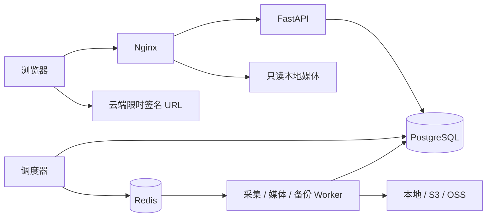

# 部署与维护

本文对应 0.2 技术预览。默认部署用于本人本机或受保护内网；公网发布另行验收 HTTPS 与对象存储访问策略。

## 服务与数据

`web` 提供静态页面、API 反向代理和经过鉴权的本地 Range 文件分发；`api` 只读媒体目录。`collector` 负责来源查询、评论与人员采集；`media-worker` 负责下载、处理、迁移与存储探测；`backup-worker` 独立持有备份密钥。`scheduler` 从数据库任务和 outbox 投递消息，Redis 不是唯一任务记录。



Compose 持久卷：`database` 数据库、`media` 内容寻址资产、`scratch` 下载及处理中间文件、`queue` Redis、`backup` 加密备份。`scratch` 不是归档；不要根据它判断备份是否成功。

```bash
docker compose ps
docker compose logs --tail=100 api collector media-worker backup-worker scheduler
docker compose stop
docker compose start
```

不要粘贴包含账号信息的完整日志。镜像版本、Python 和 npm 依赖均固定于提交；升级依赖需重新验证来源适配器与备份恢复。

## 初次配置

1. 用 `python deploy/start.py` 启动，首次在交互式终端显示管理员密码；也可在本机 `.env` 查看。访问 `http://localhost:8788`。后台可创建编辑或只读账号。
2. 添加采集账号 Cookie；服务端使用 `TREASURE_SECRET_KEY` 加密。账号验证是异步任务，只有成功结果才代表验证通过。
3. 设置存储位置、默认位置和系统采集策略。
4. 在“自动备份”添加收藏夹或 UP 来源，支持已知 B 站链接和纯 ID。选择首次处理策略，核对自动检查开关后保存；也可关闭开关先手动检查。任务不会从网站播放操作中触发。
5. 观察任务和 capture 状态。遇到登录失效、风控、权限不足应更新凭据或暂停处理，系统不会绕过验证。

来源策略覆盖系统策略，任务入队时固定策略快照，派生下载任务沿用同一快照。`request_budget` / `max_pages` 控制一轮处理量，未遍历完会留下 checkpoint；这不是“请求额度用完就宣告全量成功”。预算主要按页和分段计数，不等于每一个 HTTP 请求的精确计数。

## 存储配置

所有位置都有 `name`、`kind`、`config`、凭据、是否默认、是否启用。资产持久化成功且校验后才登记可读位置；修改默认位置不自动迁移已有数据。

| 后端 | config 常用字段 | 凭据字段 |
| --- | --- | --- |
| local | `root`，必须位于容器 `/data/media` 下 | 无 |
| s3 | `endpoint`、`region`、`bucket`、`prefix`、`addressing_style`（auto/path/virtual） | `access_key_id`、`secret_access_key`、可选 `session_token` |
| oss | `endpoint`、`bucket`、`prefix` | `access_key_id`、`access_key_secret`、可选 `security_token` |

可选 `public_endpoint` 用于浏览器可以到达的签名域名；`read_priority` 越小越优先；`part_size` 控制 multipart 分片大小。后端已有资产时不允许悄悄修改桶、目录等定位参数，应新增位置后迁移。凭据不回显。

对象存储需要私有桶，凭据仅授予目标 prefix 的读写、列举和 multipart 所需权限。浏览器跨域播放/字幕需要正确 CORS：允许本站 Origin、GET/HEAD、Range；暴露 Content-Length、Content-Range、Accept-Ranges、ETag。签名 URL 有效期间持有人可以访问对应对象，请勿把完整签名 URL 写入公开日志。

“探测”在 Worker 中创建随机临时对象，验证写入、HEAD、读回哈希、Range 后清理。真实浏览器 CORS、签名续期和 multipart 中断恢复仍需分别测试。迁移会读回 SHA-256 校验，并保留原位置。

后台“副本与分发”可按视频同步原档、兼容副本、分片依赖、封面、字幕、弹幕、评论图片及相关人员头像到指定位置。任务固定资产清单并保存检查点；后续新增的资产需再次同步。副本先停用才可删除，停用前会验证另一个可读副本。删除前再次校验另一个独立副本的完整 SHA-256，拒绝最后一个副本、同一底层对象的别名和进行中的备份冲突。物理删除在 Worker 执行且不可恢复；界面要求输入 DELETE。启用版本控制但未记录具体版本的云对象，删除可能只是写入删除标记，不能据此宣称释放了历史版本占用空间。

本地多磁盘应将各宿主目录挂载到 `/data/media/<名称>`，并保持 api/web 对应只读挂载与 Worker 可写挂载一致。不要把 Windows 宿主路径直接填入容器后台。

## 备份和恢复

`TREASURE_SECRET_KEY` 用于解密业务凭据，`TREASURE_BACKUP_KEY` 用于独立加密备份，二者不能互相替代。另存两把密钥到独立安全位置；仅复制数据库不足以恢复加密凭据，丢失备份密钥无法恢复备份内容。

后台备份配置目的地填 `/backups` 后可手动创建，或启用调度。**默认命名卷仍在同一台机器上，只能用于功能验证。** 正式使用将 backup-worker 的 `/backups` 改为独立 NAS / 异机挂载目录，并确认 UID 10001 可以读写。当前备份目的地为目录，不支持直接填写 `s3://` 或 `oss://`；媒体存储支持云端不等于备份仓库原生支持云端。

实现会将数据库 dump 与资产清单放在同一 PostgreSQL 导出快照，读取各存储资产，按 SHA-256 去重，使用 AES-GCM 分块加密；校验成功后才标记完整。备份策略的 `retention_days` 为保留目标，**当前版本不自动清理备份**。

```bash
docker compose exec -T backup-worker python -m app.cli backup --destination /backups
docker compose exec -T backup-worker python -m app.cli verify-backup /backups BACKUP_ID
```

恢复前先准备一个**空数据库和空媒体目录**。恢复工具拒绝覆盖非空目标；旧版本的备份在该目标库内迁移至当前结构。恢复会清除登录与播放会话、停用来源与旧存储、暂停任务和自动统计 / 媒体准备、清除未完调度批次，并将恢复资产映射到新本地位置。验收恢复结果后再手动开启所需调度。

```bash
docker compose exec backup-worker python -m app.cli restore-backup /backups BACKUP_ID --database-url "EMPTY_DATABASE_URL" --media-root /data/scratch/restored-media
```

上面连接串和 ID 为占位符，实际连接串不要写入共享终端记录。恢复后在独立环境检查数据、播放和头像，切换新环境的数据库连接与媒体挂载，保留原 `TREASURE_SECRET_KEY`，重新登录并审计来源设置后再开启任务。不要把恢复演练直接指向业务库。

## 升级、恢复到旧版本与凭据

升级前先创建并验证备份，保存正在使用的 Git commit / 镜像标签和配置。拉取代码后运行 `docker compose up -d --build`；`init` 自动执行 Alembic。失败时先停止新任务；涉及不兼容数据迁移，应把备份恢复到独立环境配合旧镜像验证，不能假设换回旧镜像就能读新数据库。

本地管理员遗失密码可执行交互式维护命令，它会撤销该用户旧会话：

```bash
docker compose exec api python -m app.cli reset-password admin
```

备份密钥当前独立由 backup-worker 持有；业务密钥由 API 与任务服务持有，支持 `TREASURE_SECRET_KEY_FILE` 注入。Compose 技术预览使用同一个数据库角色；公网正式部署前需拆分迁移/备份/运行角色并验证最小权限。后台账号页可“更新凭据”，关联来源无需重建；账号正在采集时会拒绝轮换，待该任务释放账号后重试，再执行账号验证。轮换不清除风控冷却。没有浏览器刷新令牌时不尝试自动刷新 B 站 Cookie。

## HTTPS 和云端上线前验收

默认 Nginx 只服务本机 HTTP。公网部署需配置证书与可信代理，将 `TREASURE_COOKIE_SECURE=true`，并添加真实域名到 `TREASURE_ALLOWED_HOSTS`。`Host` 和协议必须贯穿代理链；当前 Nginx 使用 `$scheme` 转发，若外层终止 TLS，应修改为仅信任该外层代理的 HTTPS 协议配置，不能接纳客户端任意伪造的 Forwarded 头。完成登录 Origin / CSRF、私有资产访问、Range、云端 CORS、过期续签和恢复演练后再开放网络。

当前没有完成公网渗透测试、万条视频性能测试或跨浏览器 HDR 兼容验收。多码率转码梯度、CDN 托管、远程字体和公开分享不在本次交付范围。

## 播放与带宽

系统设置可控制长视频自动分片（默认时长至少 300 秒）、目标分片时长（默认 6 秒）和响度分析。实际分片边界服从原始关键帧，不能承诺每片恰好 6 秒。后台也可对指定原档手动准备播放文件。分片与原档分别保存，会额外占用存储；不生成画质梯度，不自动降画质。

播放器按需请求 fMP4 分片，限制预缓冲，默认使用原档对应的分片；用户可显式选择兼容副本。播放清单在鉴权后按会话生成，分片 URL 不写入永久签名；本地使用 Nginx Range 和私有缓存，云端请求时获取短效签名。浏览器、系统和设备必须支持原始视频及音频编码。无法解码时显示原因，不用静音或自动降画质冒充成功。

节点只在拥有完整且已校验的资产集合时参与选路。最多探测三个候选节点，每节点默认 64 KiB（上限 128 KiB），浏览器短期复用测量结果；按延迟和吞吐综合选择。服务端探测与当前用户的浏览器测量分别标记，不能把服务器到桶的延迟当作用户体验。播放会话固定节点，遇错误最多切换两次，避免逐片反复测速。云端需要正确 Range / CORS；浏览器无权限读取时不伪造测速成绩。

音量平衡只分析并保存响度，播放时应用不超过 1 的增益衰减，默认目标 -18 LUFS；不会重编码归档音轨、压缩动态或提高超过原始峰值。安静片源可能仍偏安静。多声道 / 杜比音轨保守旁路，避免破坏空间音频输出。杜比视界需 DOVI 配置及 RPU 标志，全景声需 E-AC-3 JOC 证据；HEVC、E-AC-3 或 5.1 标签本身不等于杜比。

## 采集节奏与统计更新

默认单个下载任务、分片并发 1、账号请求间隔 3 秒、视频间隔 60 秒、随机附加间隔最多 10 秒。后台可调整，长视频不会通过提高并发抢占源站。请求节奏、下一视频时间、风险次数与冷却截止时间写入数据库，重启后仍生效。上游限流尊重 Retry-After 并退避；等待共享账号的冷却或锁不消耗失败重试次数。验证码或登录失效会留下明确状态，不能保证任何采集策略绝不触发风控。

“统计更新”默认关闭。选定授权账号并开启后，可设每 1–720 小时刷新全部已保存 BV 视频，默认 6 小时；任务错开入队且仍服从账号限速。保存 view / like / coin / favorite / share / reply / danmaku 及观察时间，未知值保留为空，不伪造零。可选重新采集弹幕，默认仅更新计数。统计任务不重新下载音视频，也不自动刷新全部评论与 UP 资料。

## 从 0.1 升级

新增迁移 `564d5950669a` 保存统计快照、播放会话、节点测量和账号节奏；`8f240c645d02` 添加后台分页调度索引。既有媒体记录填充空 metadata，不移动或删除媒体文件。升级前创建并验证备份。媒体维护和全库统计每批最多处理 100 条，未完成每 5 秒继续；媒体扫描周期完成后至少等 1 分钟再开始下一轮。可提前关闭自动媒体准备以避免升级后处理存量原档。弹幕语义审核已取消，没有需要下载或启动的模型。

## 0.3 自动备份与升级

迁移 `a9130d724e61` 新增通行密钥、单次挑战、来源观察和条目观察字段。历史视频不会移动或重编码。旧来源没有检测基线时，会先完成一次可恢复的基线扫描；已有完整归档按任务策略复用，失败任务不会因每轮检查自动获得无限重试预算。

每个来源可以独立设置首次全量、最近 N 个或只追踪新增。三种模式均建立可见列表的元数据基线；“最近 N 个”限制初次下载数量，“只追踪新增”不下载基线中的历史项。之后按固定页数进行增量检查（默认 3 页），定期全量校对（默认 24 小时）。数量过大或检查预算用完时保留游标，后续继续。界面区分初次发现、来源新发布 / 新收藏、入队与复用，检查历史保留每轮结果。

“只追踪新增”的起点是订阅保存时间；首次任务排队或扫描期间发生的新发布 / 新收藏也会进入归档判断。起点一经保存，不随失败重试或列表不稳定重扫改变。未知源时间保守跳过，旧视频重新收藏可作为新事件，但用户取消和失败待处理的历史任务仍需人工决定是否重试。

全量校对复查首页指纹、总数及重复条目；列表不稳定时不更新完整校对时间、不标记未观察项。一次有界校对并不是源站快照，不能保证源站持续变化时绝不漏项，后续全量用于收敛。源站移除只改变观察状态，不物理删除归档。UP 置顶、投稿发布时间与收藏时间分别处理，不把“遇到旧时间”当作停止条件。

## 通行密钥

登录后点击头像进入“账号与安全”，输入当前密码添加设备通行密钥。支持多把密钥，单账号最多 10 把；注册和登录要求用户验证。撤销密钥会撤销由它签发的会话；密码入口保留。服务端只保存公钥、计数和设备标识，不接收生物特征或私钥。备份恢复保留已登记公钥，但清除旧会话、待完成挑战和限流记录。

本机默认配置：

```dotenv
TREASURE_PASSKEY_RP_ID=localhost
TREASURE_PASSKEY_ORIGIN=http://localhost:8788
TREASURE_PASSKEY_RP_NAME=Treasure Up
TREASURE_PASSKEYS_ENABLED=true
```

正式域名配置举例：RP ID 为 `archive.example.com`，Origin 为 `https://archive.example.com`（非默认端口须包含端口），同时设置 allowed hosts 与 Secure Cookie。RP ID 是不带协议和端口的精确域名。更换 RP 域名后旧凭据无法迁移验证，应先确保密码可用，再在新域名重新登记。原生 WebView 的通行密钥能力取决于系统和关联域名配置，当前仍保留密码回退，不能据浏览器测试宣称所有设备均通过。

## 部署模式与客户端

`python deploy/start.py` 启动标准模式；`python deploy/start.py --light` 合并采集和媒体处理进程，单并发消费两类队列，长任务可能相互等待。备份进程继续独立持有备份密钥。模式切换仅在新模式启动健康后停止旧处理进程，采用 60 秒优雅停止；被中断的任务由已有租约恢复机制接管。持久卷、备份和数据库不删除。直接手工 Compose 启动时应自行停止上一模式的 Worker。

首次部署可传 `--origin https://archive.example.com --port 8788`；这只生成站点配置，不申请 TLS 证书或建立公网代理。已有 `.env` 时参数不覆盖配置，需自行编辑站点环境项。非交互终端不输出初始密码，已有部署不重新打印旧密码。遗忘密码仍用上文维护命令。

可安装 Web 应用只缓存离线提示和公共图标，API、媒体、凭据与 Range 请求不进入 Service Worker 缓存。独立客户端工程、平台构建与签名要求见 [native/README](../native/README.md)。客户端仅保存服务地址；B 站 Cookie、云存储密钥和采集调度留在 Docker 服务端。
