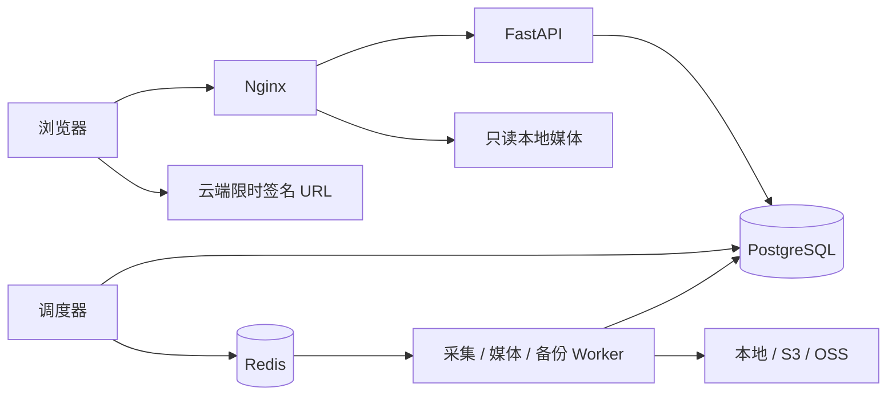

# 部署与维护

本文对应 0.1 技术预览。默认部署用于本人本机或受保护内网；公网发布另行验收 HTTPS 与对象存储访问策略。

## 服务与数据

`web` 提供静态页面、API 反向代理和经过鉴权的本地 Range 文件分发；`api` 只读媒体目录。`collector` 负责来源查询、评论与人员采集；`media-worker` 负责下载、处理、迁移与存储探测；`backup-worker` 独立持有备份密钥。`scheduler` 从数据库任务和 outbox 投递消息，Redis 不是唯一任务记录。



Compose 持久卷：`database` 数据库、`media` 内容寻址资产、`scratch` 下载及处理中间文件、`queue` Redis、`backup` 加密备份。`scratch` 不是归档；不要根据它判断备份是否成功。

```bash
docker compose ps
docker compose logs --tail=100 api collector media-worker backup-worker scheduler
docker compose stop
docker compose start
```

不要粘贴包含账号信息的完整日志。镜像版本、Python 和 npm 依赖均固定于提交；升级依赖需重新验证来源适配器与备份恢复。

## 初次配置

1. 在本机 `.env` 获取生成的管理员密码并登录。后台可创建编辑或只读账号。
2. 添加采集账号 Cookie；服务端使用 `TREASURE_SECRET_KEY` 加密。账号验证是异步任务，只有成功结果才代表验证通过。
3. 设置存储位置、默认位置和系统采集策略。
4. 新增收藏来源，填 B 站收藏夹 ID 并关联账号；先手动扫描，再按需启用周期同步。任务不会从网站播放操作中触发。
5. 观察任务和 capture 状态。遇到登录失效、风控、权限不足应更新凭据或暂停处理，系统不会绕过验证。

来源策略覆盖系统策略，任务入队时固定策略快照，派生下载任务沿用同一快照。`request_budget` / `max_pages` 控制一轮处理量，未遍历完会留下 checkpoint；这不是“请求额度用完就宣告全量成功”。预算主要按页和分段计数，不等于每一个 HTTP 请求的精确计数。

## 存储配置

所有位置都有 `name`、`kind`、`config`、凭据、是否默认、是否启用。资产持久化成功且校验后才登记可读位置；修改默认位置不自动迁移已有数据。

| 后端 | config 常用字段 | 凭据字段 |
| --- | --- | --- |
| local | `root`，必须位于容器 `/data/media` 下 | 无 |
| s3 | `endpoint`、`region`、`bucket`、`prefix`、`addressing_style`（auto/path/virtual） | `access_key_id`、`secret_access_key`、可选 `session_token` |
| oss | `endpoint`、`bucket`、`prefix` | `access_key_id`、`access_key_secret`、可选 `security_token` |

可选 `public_endpoint` 用于浏览器可以到达的签名域名；`read_priority` 越小越优先；`part_size` 控制 multipart 分片大小。后端已有资产时不允许悄悄修改桶、目录等定位参数，应新增位置后迁移。凭据不回显。

对象存储需要私有桶，凭据仅授予目标 prefix 的读写、列举和 multipart 所需权限。浏览器跨域播放/字幕需要正确 CORS：允许本站 Origin、GET/HEAD、Range；暴露 Content-Length、Content-Range、Accept-Ranges、ETag。签名 URL 有效期间持有人可以访问对应对象，请勿把完整签名 URL 写入公开日志。

“探测”在 Worker 中创建随机临时对象，验证写入、HEAD、读回哈希、Range 后清理。它不会冒充完整云端验收：真实浏览器 CORS、签名续期和 multipart 中断恢复仍需分别测试。迁移会读回 SHA-256 校验，并保留原位置；首版没有自动物理删除旧副本。

本地多磁盘应将各宿主目录挂载到 `/data/media/<名称>`，并保持 api/web 对应只读挂载与 Worker 可写挂载一致。不要把 Windows 宿主路径直接填入容器后台。

## 备份和恢复

`TREASURE_SECRET_KEY` 用于解密业务凭据，`TREASURE_BACKUP_KEY` 用于独立加密备份，二者不能互相替代。另存两把密钥到独立安全位置；仅复制数据库不足以恢复加密凭据，丢失备份密钥无法恢复备份内容。

后台备份配置目的地填 `/backups` 后可手动创建，或启用调度。**默认命名卷仍在同一台机器上，只能用于功能验证。** 正式使用将 backup-worker 的 `/backups` 改为独立 NAS / 异机挂载目录，并确认 UID 10001 可以读写。当前备份目的地为目录，不支持直接填写 `s3://` 或 `oss://`；媒体存储支持云端不等于备份仓库原生支持云端。

实现会将数据库 dump 与资产清单放在同一 PostgreSQL 导出快照，读取各存储资产，按 SHA-256 去重，使用 AES-GCM 分块加密；校验成功后才标记完整。备份策略的 `retention_days` 为保留目标，**当前版本不自动清理备份**。

```bash
docker compose exec -T backup-worker python -m app.cli backup --destination /backups
docker compose exec -T backup-worker python -m app.cli verify-backup /backups BACKUP_ID
```

恢复前先准备一个**空数据库和空媒体目录**。恢复工具拒绝覆盖非空目标；恢复会清除会话、停用来源与旧存储、暂停任务，并将恢复资产映射到新本地位置。

```bash
docker compose exec backup-worker python -m app.cli restore-backup /backups BACKUP_ID --database-url "EMPTY_DATABASE_URL" --media-root /data/scratch/restored-media
```

上面连接串和 ID 为占位符，实际连接串不要写入共享终端记录。恢复后在独立环境检查数据、播放和头像，切换新环境的数据库连接与媒体挂载，保留原 `TREASURE_SECRET_KEY`，重新登录并审计来源设置后再开启任务。不要把恢复演练直接指向业务库。

## 升级、恢复到旧版本与凭据

升级前先创建并验证备份，保存正在使用的 Git commit / 镜像标签和配置。拉取代码后运行 `docker compose up -d --build`；`init` 自动执行 Alembic。失败时先停止新任务；涉及不兼容数据迁移，应把备份恢复到独立环境配合旧镜像验证，不能假设换回旧镜像就能读新数据库。

本地管理员遗失密码可执行交互式维护命令，它会撤销该用户旧会话：

```bash
docker compose exec api python -m app.cli reset-password admin
```

备份密钥当前独立由 backup-worker 持有；业务密钥由 API 与任务服务持有，支持 `TREASURE_SECRET_KEY_FILE` 注入。Compose 技术预览使用同一个数据库角色；公网正式部署前需拆分迁移/备份/运行角色并验证最小权限。当前 Cookie 更新采用新建授权账号并调整来源，尚未提供原账号凭据轮换界面。

## HTTPS 和云端上线前验收

默认 Nginx 只服务本机 HTTP。公网部署需配置证书与可信代理，将 `TREASURE_COOKIE_SECURE=true`，并添加真实域名到 `TREASURE_ALLOWED_HOSTS`。`Host` 和协议必须贯穿代理链；当前 Nginx 使用 `$scheme` 转发，若外层终止 TLS，应修改为仅信任该外层代理的 HTTPS 协议配置，不能接纳客户端任意伪造的 Forwarded 头。完成登录 Origin / CSRF、私有资产访问、Range、云端 CORS、过期续签和恢复演练后再开放网络。

首版没有完成公网渗透测试、万条视频性能测试或跨浏览器 HDR 兼容验收。HLS、多码率、CDN、远程字体和公开分享不在本次交付范围。
