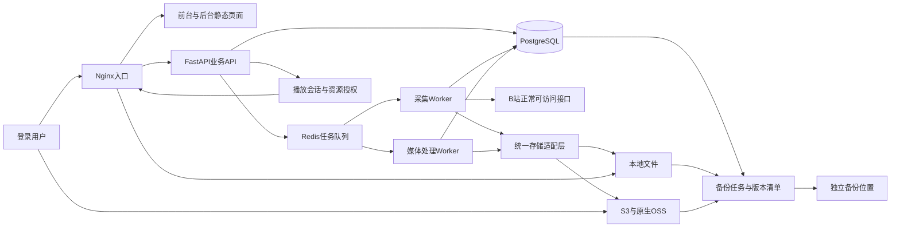
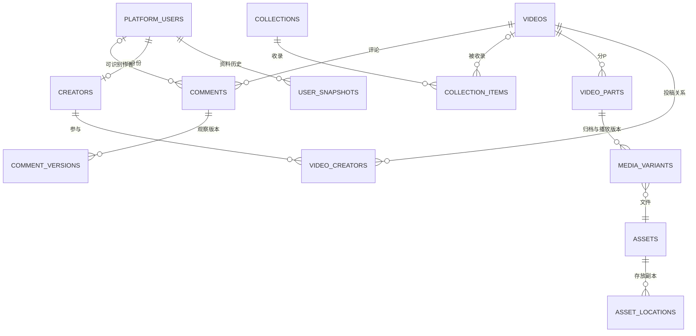

# B站私人视频备份库技术路线与实施计划审计稿

面向：小云

版本：v0.1，2026年10月3日
状态：原审计稿；2026年10月3日小云随后授权开始实施，并指定 GitHub 项目 `guoweiyi/treasure-up`。原文保留作为设计基线；实际完成与未验收项见 [实施状态](implementation-status.md)。

本计划覆盖采集、视频存储与分发、评论与人员资料、UP主独立主页、前后台、Docker部署和备份恢复。本轮仅调查公开资料并编写计划书，没有修改应用代码、安装依赖、创建数据库或容器、连接对象存储，也没有使用账号 Cookie 进行新的采集。

建议采用 **Vue 3 与 TypeScript 前端、FastAPI 模块化后端、独立采集处理 Worker、PostgreSQL、Celery 与 Redis、Nginx，以及本地／S3／原生 OSS 三种存储适配器**。先完成一套可恢复、可迁移的私人归档系统；MP4 按需范围读取作为首版播放路径，HLS、多码率与 CDN 作为有明确需求后再启用的能力。现有播放器只是技术证据，正式页面和架构不以它为定稿。

文中“建议”是待审计的工程选择，“已验证”仅指前轮样本实测，“公开资料依据”不等于本项目已完成接入。末尾列出需要你拍板的决策和逐项验收标准。

此前调查里的SQLite和Node编排建议面向小样本技术验证；本计划按新增的评论、人员、多人权限与可靠恢复要求重新选型。旧实验记录继续作为证据，不作为本方案的组件约束。

## 一 项目边界与需求对应

产品默认定位为本人管理、登录后访问的私人视频库。可以开放额外只读账号，但不默认做公开视频分发、社交互动或跨平台内容推荐。前台只读归档，后台负责采集、整理、配置及维护；播放和搜索已保存内容时不依赖 B 站在线接口。

| 编号 | 你的要求 | 本方案的明确承诺 |
| --- | --- | --- |
| R01 | 完整视频储存与分发 | 稿件、多P、实际媒体版本、封面、字幕、弹幕、评论和人员资源分别建模；可校验、迁移、恢复 |
| R02 | S3、阿里云OSS、本地存储 | 三个第一类适配器；同一实例可同时配置多个存储位置，不要求全部数据放同一个后端 |
| R03 | Docker部署 | Linux Docker Compose 标准部署，持久卷、健康检查、升级和回滚流程明确 |
| R04 | 数据备份 | 数据库、不可变媒体、评论快照、头像等图片、配置和独立密钥恢复路径；在空环境演练 |
| R05 | 后台信息标注及完整配置 | 来源信息和人工标注分离；采集策略、存储、播放、人员、评论、任务、备份、权限均有管理入口 |
| R06 | 连带评论与人员姓名昵称头像 | 采集本次接口可见的顶层和楼中楼；保存公开显示名、UID及头像文件，并保留当时快照 |
| R07 | UP主单独建表和主页 | 独立 creators 表、主投稿与合作关系、本地主页、简介、历史昵称搜索、已保存视频查询 |
| R08 | 简约好看的前台 | 以视频、UP主和收藏为主要内容；单独设计消费界面，不把后台组件或技术诊断搬到前台 |
| R09 | 先探索，不实施 | 本文件是审计材料；分期、字段和接口均为设计，不表示相应系统已建成 |

“人员姓名”按公开资料理解为 **平台昵称或显示名**。没有公开真实姓名时不补猜、不关联站外身份。普通弹幕的作者字段通常是 `midHash`，不能可靠等同账号 UID，因此不能承诺给每条弹幕补齐姓名和头像；评论作者和UP主能够按公开 UID 归档。[弹幕字段定义](https://github.com/bilibili-plugins/bilibili-api-collect/blob/master/grpc_api/bilibili/community/service/dm/v1/dm.proto)

暂用以下容量假设进行架构选择：单管理员、小范围授权观看、1万条视频量级起步、媒体可增长到数TB。它们不是容量或性能承诺；实际收藏规模、平均时长、并发人数、预算、部署位置需要在审计时确认。

## 二 已有证据与必须补齐的验证

前轮已验证：有效会员登录态、收藏夹发现、从一个收藏夹选择单条视频、1080P高码率 H.264/AAC 下载和完整解码、当前弹幕、本地播放及弹幕样式设置。涉及个人收藏的实测记录仅保留在本机，不随正式仓库发布。

这证明了单条样本的核心链路，尚未证明完整收藏分页、多P、长期增量、所有会员档位、评论全量、UP资料、三种存储、Docker和灾难恢复。本轮没有新增账号实测。

| 风险点 | 计划如何处理 |
| --- | --- |
| B站网页接口变化、签名或风控 | 独立 BilibiliAdapter，保留解析版本和响应状态；限流、停止与恢复入口；更新后用固定样本回归 |
| 账号可见范围不等于全部历史内容 | 明确“本次可见遍历完成”，保留采集窗口和缺失原因 |
| 下载成功不等于文件完整或可播 | 长度与哈希校验、媒体探测、验证策略和播放验收分别记录 |
| 某一环节失败拖垮整条归档 | 视频、弹幕、评论、人员和图片独立状态、独立补采 |
| 第三方项目停止维护 | 不把单个大型非官方SDK作为核心模型；下载器、接口适配和播放UI各自可替换 |

当前公开的 yt-dlp B站实现可继续作为媒体提取候选，但其评论代码仅处理旧接口分页及已内嵌的子评论，不能承担本项目完整楼中楼归档。原 Nemo2011 API 项目目前显示停止维护和关停声明，不作为新系统的长期基础依赖。[yt-dlp源码](https://github.com/yt-dlp/yt-dlp/blob/master/yt_dlp/extractor/bilibili.py)、[原项目现状](https://github.com/Nemo2011/bilibili-api)

## 三 总体技术路线

### 3.1 推荐组件

| 层 | 推荐选择 | 原因及可替换边界 |
| --- | --- | --- |
| 前台 | Vue 3、TypeScript、Vite、Vue Router | 私人内容库主要是交互和本地数据查询，首版不依赖SEO；按内容页独立设计样式 |
| 后台 | 同一前端仓库的独立 admin 入口，采用成熟表单和表格组件 | 复用API类型和身份状态；后台强调编辑、批量操作、反馈和审计，避免自行重造基础控件 |
| API | FastAPI、Pydantic、SQLAlchemy、Alembic | 统一类型验证、OpenAPI契约与数据库迁移；业务按模块组织，不拆成大量微服务 |
| 持久数据库 | PostgreSQL | 人员、评论树、归档版本及资产关系需要事务和约束；JSONB仅承载扩展字段或来源片段 |
| 异步任务 | Celery、Redis；任务账本保存在PostgreSQL | 下载、解析、转封装、图片归档与备份脱离HTTP请求生命周期；队列丢失可由账本恢复 |
| 媒体工具 | 受控版本的 yt-dlp、FFmpeg、ffprobe | 提取媒体、转封装、探测及必要的兼容副本；以独立进程适配，限制超时与资源 |
| 播放器 | Artplayer是已验证候选；播放器适配层独立 | 保存原始弹幕和标准化数据，避免数据格式被某个播放器锁定 |
| 存储 | LocalAdapter、S3Adapter、OssAdapter | 共同业务接口；保留各家真实能力差异，不强行把OSS当作完整S3 |
| 入口与本地媒体 | Nginx | HTTPS、静态前端、API代理、本地文件的受控分发；业务API不逐字节搬运大视频 |
| 部署 | Linux Docker Compose | 先服务于单机/NAS/云主机；需要更多吞吐时先独立扩Worker和存储，再考虑集群 |

FastAPI官方把重型、跨进程后台工作与简单请求后任务区分，提示可采用Celery等工具。本项目长任务和断点恢复选择独立Worker，是工程建议而非框架强制。[FastAPI后台任务说明](https://fastapi.tiangolo.com/tutorial/background-tasks/)

版本在实施开始时选择受支持的稳定版本并锁定镜像摘要、Python/前端锁文件和媒体工具版本，不把“永远跟随latest”写入部署规则。

### 3.2 主要备选与取舍

| 备选 | 何时值得选择 | 本次建议 |
| --- | --- | --- |
| NestJS与BullMQ，外接Python/CLI采集 | 团队以TypeScript为主，已有Node运维经验 | 可行；相比Python统一采集与API，会增加跨语言任务协议，暂不优先 |
| React、Next.js或Nuxt服务端渲染 | 有成熟团队组件或公开搜索引擎收录需求 | 不因现有样机使用JavaScript就直接定案；私人库首版推荐简单SPA |
| Django及其管理后台 | 接受较多框架约定、希望快速得到数据管理后台 | 可减少基础管理开发；本项目采集任务、存储迁移和定制前后台仍需专门设计 |
| SQLite与单进程内存队列 | 一次性本地工具、无并发、无复杂恢复要求 | 不作为完整方案，难以匹配多Worker、评论增量和后台审计 |
| 全量HLS与多码率转码 | 多终端、弱网观看和并发需求已明确 | 不预先为每条视频制造多套大文件；保留按策略生成能力 |

### 3.3 组件关系

图中用户访问对象存储仅限后端授权后取得的短期资源地址；没有向浏览器下发存储密钥。采集只发生在Worker，打开前台页面不会触发一次远端爬取。

## 四 数据模型

### 4.1 身份与内容的核心关系

`BVID/AID`标识稿件，`CID`标识分P。媒体与弹幕属于分P；普通视频评论区属于稿件AID，而不是每个CID各有一份。多个收藏夹保存同一稿件时复用视频和资产。

所有平台长整型标识在API和JSON中按字符串传输，避免JavaScript数值精度丢失。数据库内部可用UUID作主键，平台ID建立唯一约束，不能用昵称或标题作唯一键。

### 4.2 建议表结构

下表是逻辑模型，不是本轮创建的数据库。可按模块逐步落地，第一阶段即应确立主键、资产和人工覆盖规则。

| 模块与表 | 关键字段或约束 | 作用 |
| --- | --- | --- |
| `platform_users` | platform、source_uid唯一；current_snapshot_id；first/last_seen_at | 所有已识别平台账号的身份层，UP主与评论者复用 |
| `user_snapshots` | user_id、observed_at、display_name、signature、avatar_asset_id、来源、字段可见状态 | 保存公开资料及昵称头像变化，不回填未公开实名 |
| `creators` | user_id唯一；本地别名、备注、标签、展示状态 | 必须独立的UP主业务表；普通评论者不会自动进入UP目录 |
| `creator_profile_overrides` | creator_id、字段、是否人工覆盖、值、编辑版本 | 人工整理简介和名称，不改变来源快照 |
| `videos`、`video_versions` | platform/bvid唯一、aid、来源标题简介标签、发布时间、状态、快照 | 一条稿件及来源信息变化；保留失效前信息 |
| `video_creators` | video_id、creator_id、owner/staff、角色名称、顺序 | 区分主投稿者与合作UP，不让staff覆盖owner |
| `video_parts` | video_id、cid、分P序号、标题、时长、状态 | 多P独立归档，顺序不作为稳定身份 |
| `collections`、`collection_items` | 类型、来源资源ID、视频关系可空、分节与顺序、采集轮次 | 收藏夹、合集、系列明确区分；失效条目保留占位，不因详情失败而丢失 |
| `video_annotations`、`tags`、`video_tags` | 人工标题、笔记、分类、星标、标签、编辑人和版本 | 本地标注；收藏来源标签与人工标签分开 |
| `media_variants` | part_id、用途、实际qn/编码/分辨率/帧率/音轨、asset_id、生成来源 | 区分归档母版、兼容播放版和自适应版本，不只存一个video_url |
| `assets` | 不可变asset_id、SHA256、字节数、媒体类型、验证状态 | 视频、音轨、封面、头像、表情、评论图片、字幕及快照的统一资产记录；用途放在引用关系中，同一文件可复用 |
| `asset_locations` | asset_id、storage_profile_id、object_key、version_id、校验时间、状态 | 一个资产可有本地、云端及备份副本；不把预签名URL写成永久位置 |
| `asset_sources`、`asset_refs` | 稳定来源标识、脱敏来源URL/时间、关联业务对象、引用用途 | 同一头像被多个评论快照引用时去重；GC根据引用和备份保留规则判断；不留存媒体临时签名查询串 |
| `subtitle_tracks` | part_id、语言、来源轨道ID、人工/平台自动字幕标记、原始及播放asset | 保存正常可见的字幕及转换关系；无字幕、不可访问和获取失败分别表示 |
| `danmaku_snapshots`、`danmaku_segments` | part_id、capture_run_id、segment_index、原始及标准化asset、条数、状态 | 原始Protobuf与播放数据均保留，历史采集轮次可追溯 |
| `comments` | `(platform,type,oid,rpid)`唯一；video_id、root_rpid、parent_rpid、author_user_id可空 | 保存评论树和稳定身份，缺父节点可建立占位关系 |
| `comment_versions` | comment_id、capture_run_id、正文、原始时间、点赞快照、作者昵称/头像快照引用 | 当前内容和观察历史分离；改名不重写历史面貌 |
| `comment_assets` | comment_version_id、asset_id、图片/表情、顺序与替代文本 | 评论关联图片实际归档，不只保存远端URL |
| `capture_runs`、`capture_pages` | 范围、账号引用、开始结束、游标、适配器版本、计数、错误、终止原因 | 判断某次采集做到了哪里，支持恢复和可见完整性审计 |
| `source_accounts`、`source_subscriptions` | 凭据引用、验证状态、收藏来源、策略引用 | B站采集账号，与本站登录账号明确分离 |
| `jobs`、`job_attempts`、`outbox_events` | 类型、目标、轮次、策略版本、幂等键、租约、进度、错误 | PostgreSQL任务账本，队列只是投递通道 |
| `storage_profiles`、`policy_versions` | 后端类型、非秘密配置、密钥引用、能力检测与生效范围 | 后台可配置且可审计，变更不静默搬迁旧资产 |
| `app_users`、`sessions`、`audit_logs` | 本站角色、会话、关键操作与配置变更 | 管理权限和观看权限分离 |
| `watch_progress`、`bookmarks` | app_user_id、part_id、播放位置、备注 | 本站观看进度和个人记录 |
| `backup_sets`、`backup_items` | 备份清单、数据库版本、资产集合、校验、密钥标识、恢复验证 | “备份完成”以可恢复的版本集合为准 |

来源资料可返回 `owner`、`staff`、`pages`、`ugc_season` 等不同层级，必须按含义建关系，不按页面卡片布局简单压平。[视频字段文档源码](https://github.com/bilibili-plugins/bilibili-api-collect/blob/master/docs/video/info.md)

### 4.3 人工标注优先规则

界面展示值由“明确设置的人工覆盖值，否则采用最新来源值”决定。空字符串与“没有覆盖”是不同状态，不能简单用真假值合并。来源更新保留新快照，但不覆盖本地标题、备注、标签或UP简介。后台提供来源值对照、恢复来源值、编辑历史和批量变更预览。

## 五 采集路线与完整性

### 5.1 采集流程

收藏分页发现 → 稿件详情与人员关系 → 分P与可用流 → 下载和校验 → 发布媒体资产；同时独立安排弹幕、评论、UP资料和图片任务。成功媒体可先播放，页面同时显示评论或头像仍在补采，不能一个绿色“成功”掩盖部分失败。

“可播放”“本次采集范围完成”“已有完整备份保护”分别计算：前者取决于已验证媒体，中者汇总本轮策略要求的子任务，后者引用完成的backup_set及其恢复点。三者不能共用一个success字段。可见遍历完成仅说明接口遍历结束，关联头像或评论图片仍可能待补；完整归档汇总会继续标记部分完成。

已有且账号正常可见的字幕纳入独立采集任务，保存原始语言、轨道来源和时间轴，再按需转换为播放器格式。不存在字幕不是任务失败；自动语音识别生成字幕、OCR及字幕翻译属于后续可选能力。本轮未验证字幕接口契约，进入P1时补证据。

公开实现从`/x/player/wbi/v2`读取分P字幕轨和字幕JSON地址，可作为适配候选。平台已有自动字幕是否保存由策略决定，不照搬参考项目过滤自动字幕的默认行为。[字幕取得实现](https://github.com/amtoaer/bili-sync/blob/main/crates/bili_sync/src/bilibili/video.rs)

收藏取消、原视频失效或UP改名只更新来源观察状态，默认保留已有归档。采集只使用账号正常可访问的媒体；受限、加密或无法支持的内容记录明确原因，不让它长期无限重试。

收藏发现和夹内资源分别记录分页范围、返回数量、终止依据和扫描状态。夹内资源候选为`/x/v3/fav/resource/list`的`media_id/pn/ps`分页及`has_more`结束信号。[收藏分页实现](https://github.com/amtoaer/bili-sync/blob/main/crates/bili_sync/src/bilibili/favorite_list.rs)

失败、预算耗尽或分页异常只保存检查点，不把未读条目标为移出。正常完成同一范围扫描后，也只更新“本轮未再观察到”状态；来源失效、移出收藏和本地删除相互独立。失效条目保留来源资源ID、类型和可见元数据，video_id暂空。扫描中收藏可能变化，必须标注采集起止时间，不宣称取得了原站瞬时原子快照。

普通视频弹幕按CID采集当前分段，每段约六分钟；预期段数优先参考可取得的元数据，缺失时按时长推算并记录依据。公开实现使用`/x/v2/dm/wbi/web/seg.so`及`segment_index`。[分段弹幕实现](https://github.com/amtoaer/bili-sync/blob/main/crates/bili_sync/src/bilibili/video.rs)

每段保存段号、采集时间、原始Protobuf、解析版本、条数和状态；全部预期段成功读取解析，才记本轮分段遍历完成。合法空段与风控HTML、截断、解析失败分开。每轮保留独立快照，可另生成按弹幕ID去重的历史汇总；多个轮次的汇总不能冒充单次快照。当前分段遍历不等于全历史弹幕。原始响应里已取得但尚不支持渲染的高级、代码或BAS数据仍保留；不承诺分段接口覆盖所有特殊类型，其获取与渲染需另验。

### 5.2 评论的两级分页

| 环节 | 调查到的接口路径与输入 | 必须保存的证据 |
| --- | --- | --- |
| 顶层评论 | `/x/v2/reply/wbi/main`，视频为`type=1`、`oid=aid`；时间序作为遍历候选 | 请求范围、WBI适配版本、`cursor.is_end`与下一游标；置顶与普通内容按rpid去重 |
| 顶层后续页 | 将`cursor.pagination_reply.next_offset`原样放入下一次`pagination_str`的offset | 不解析或自己推算不透明游标；记录重复游标和恢复点 |
| 每个楼中楼 | `/x/v2/reply/reply`，`type/oid/root/pn/ps` | 每个根独立分页；不能把顶层响应的replies预览视为全部回复 |
| 人员与关联图片 | 评论`member.mid/uname/avatar`及图片、表情引用 | 公开身份、采集时名称、头像文件、资产失败与补采状态 |

这些路径来自社区对网页行为的记录，并非B站官方对外稳定API承诺；进入实施后必须先做少量受控契约验证。[评论分页记录源码](https://github.com/bilibili-plugins/bilibili-api-collect/blob/master/docs/comment/list.md)、[评论对象字段源码](https://github.com/bilibili-plugins/bilibili-api-collect/blob/master/docs/comment/readme.md)

完整性用 `pending / running / partial / visible_traversal_complete / blocked / failed / skipped` 表达，分别记录顶层、各根楼中楼和图片。只有合法结束条件得到满足才记为本次可见遍历完成。缺游标、提前空页、重复页面、数量预算耗尽、风控和评论关闭都不是“零条且成功”。

默认目标是本次接口可见范围的完整遍历；若设置了单轮请求预算，到预算后保存检查点并排队续采，状态保持partial。不能把预算截断改写成完成。展示示例：“已保存1,280条，12个楼中楼待补，最后采集于……”。服务器总数仅作参考，不能当作必然可获取数量。

首次遍历后：新顶层采取带重叠的时间序扫描；近期活跃旧楼复查回复；旧楼低频轮巡；按策略周期性复核。正文、点赞和作者资料变化保存观察版本；单轮未出现不等于被删除。删除、隐藏、精选审核和采集期间持续新增，都可能使保存数与平台显示数不一致。

### 5.3 人员资料与头像

UP资料候选路径为`/x/space/wbi/acc/info?mid=`；可观察昵称、头像和签名。备用公开卡片路径的简介应读取`data.card.sign`，不能把意义不同的description字段直接当简介。每个字段保留来源与观察时间。[用户资料记录源码](https://github.com/bilibili-plugins/bilibili-api-collect/blob/master/docs/user/info.md)

UP主归档公开主页资料；普通评论者优先采用评论响应内已给出的公开名称和头像，不为显示一条评论额外扫描该用户全部主页。头像、封面、评论图片和表情保存实际文件并按内容去重；旧头像保留供历史评论快照使用。获取失败显示本地占位图并建立补采任务。

缺失UID、匿名或已注销作者保持未知，不能把所有`mid=0`合并成一个真实账号。原始资料中的未公开字段不推断；弹幕midHash单独保存为来源字段，不反推评论者身份。

### 5.4 任务可靠性

每次归档轮次建立子任务：metadata、media、danmaku、subtitles、comments_roots、comments_replies、profiles、images、verify、publish。元数据和评论等观察任务的幂等键包含种类、目标、采集轮次及策略版本；媒体取得使用跨轮次稳定需求键，不能把capture_run_id放进媒体去重键。

媒体需求键建议由platform、CID、选定格式指纹和本地acquisition_generation组成；格式指纹包含实际视频/音频格式ID、编码和档位，不包含临时URL、标题或点赞数。先查询已验证资产并加跨Worker唯一约束/租约，再决定下载；多个收藏和多个同步轮次复用同一结果。策略配置改动但选出的格式相同，不重复取得。内容SHA256负责文件最终校验和去重，不能替代下载前复用。

CID变化、新增音轨或选定格式变化形成新媒体需求；确认来源版本变更或明确强制重采才提升acquisition_generation。平台不应被假定提供可靠的文件revision：若它静默替换同CID、同格式的字节，单靠元数据轮巡不能保证发现。需要更强检查时使用独立复核策略，并显示可能增加的下载量；已有归档不被无声覆盖。

业务事务同时写任务账本和outbox，投递器可靠投递到队列。Worker持租约、定期心跳、保存分页或下载检查点；异常退出后由调度器认领过期任务。队列按至少一次交付设计，不能宣称天然“只执行一次”。

Celery任务需具备幂等性，Redis的可见性超时必须与长任务上限、重试和恢复策略协调，避免长下载被重复投递；远期定时计划写数据库，不靠长时间挂起的消息。[Celery任务说明](https://docs.celeryq.dev/en/stable/userguide/tasks.html)、[Redis传输注意事项](https://docs.celeryq.dev/en/stable/getting-started/backends-and-brokers/redis.html)

账号级总限速在所有Worker间共享。首轮建议单账号一个媒体下载、一个元数据请求通道，间隔和每日预算可配，实际值由受控验证决定。遇429或平台风控先退避暂停，Cookie失效进入待处理；不靠增大并发或不断换请求参数掩盖问题。

## 六 视频资产与存储策略

### 6.1 归档和播放版本分离

| 版本 | 目的 | 建议策略 |
| --- | --- | --- |
| 归档母版 | 保留账号当次能够取得的实际质量和编码 | 保存选定的最高可见档位，记录选择策略与实际结果；优先无损转封装，不无谓重编码 |
| 兼容播放版 | 浏览器和常见设备易于播放 | 优先复用已有H.264/AAC MP4；需要时才生成兼容副本 |
| 自适应HLS版 | 弱网、跨终端与并发优化 | 按需离线生成；记录分片及清单依赖关系，作为可重建派生资产 |

“最高可见”与“保证所有视频取得4K/HDR/杜比”不同。HDR归档与SDR播放副本需要明确色彩转换流程，不能只去掉HDR标记。画质菜单只列已保存且可播放的版本，显示实际编码、分辨率和帧率。

MP4使用faststart改善渐进播放；它调整元数据位置，不替代HTTP Range，也不会自动生成多码率。HLS作为后续派生输出，浏览器原生支持或hls.js适配需按目标终端验证。[FFmpeg封装文档](https://ffmpeg.org/ffmpeg-formats.html)、[hls.js项目](https://github.com/video-dev/hls.js)

### 6.2 稳定资产标识与发布

对象路径以不可变ID和哈希组织，例如`assets/sha256/ab/<hash>`；可读导出目录另生成标题和BV信息。改标题、昵称和存储供应商不改变业务ID。数据库保存storage_profile、key、version_id和SHA256，不保存长期有效的播放URL。

写入流程：临时文件／分片上传 → 大小及校验确认 → 媒体探测 → 发布不可变对象 → 事务写入已验证location → 标记可用。上传中间文件不向前台发布。对象存储不存在通用的原子重命名，应通过不可变key和数据库可用状态切换完成发布。

HEAD和字节数只能证明对象存在且长度符合；应用自行计算SHA256，并记录目标端校验能力及是否做过读回。multipart、加密等情况下ETag不能统一当成内容MD5。

每条稿件提供版本化manifest，包含稿件、分P、UP关系、媒体资产哈希、弹幕/评论快照和图片引用。manifest不含Cookie、存储密钥或短期签名地址。它用于移植和灾后重建，不替代数据库事务。

### 6.3 多存储位置和迁移

同一资产可以有多个location，按读写优先级和验证状态选择。默认本地或云端为主存，另一个位置可作为副本；明确区分在线副本与有独立恢复历史的备份。

迁移执行“复制 → 逐项校验 → 更新读优先级 → 保留旧副本一段时间 → 按审计策略回收”。后台更改默认存储只影响新任务，不隐式移动或删除已有文件。云端不可用时，仅对已有且验证通过的副本回退；没有副本则如实显示暂不可播放。

临时盘预留至少覆盖并发任务的源视频轨、音频轨、输出文件和派生处理峰值，并设安全水位。不能仅用最终MP4大小估算处理盘；空间不足先暂停新任务，避免写满数据库所在磁盘。

### 6.4 三类适配器的能力合同

| 能力 | 本地文件 | S3与经过验证的兼容服务 | 阿里云OSS原生 |
| --- | --- | --- | --- |
| 读写定位 | 受控根目录与相对key | endpoint、region、bucket、key | OSS endpoint、region、bucket、key |
| 大文件上传 | 临时文件、断点记录、同文件系统发布 | Multipart及恢复/中止 | 原生分片上传及恢复/中止 |
| 内容验证 | SHA256及大小 | 应用SHA256和可用的原生checksum | 应用SHA256及可用的CRC64等 |
| 播放读取 | Nginx受控目录、Range | 私有对象、GET/HEAD及单Range | 私有对象、GET/HEAD及单Range |
| 版本和生命周期 | 应用管理 | 按实际提供商能力声明 | 按OSS实际配置及存储类型声明 |
| 读取地址 | 同源授权路由 | 后端签发短期地址或受控代理 | 原生SDK签名地址或受控代理 |
| 必验项目 | 越界、符号链接、磁盘满、权限 | 地址风格、签名、分片、范围读取、校验 | 原生签名、分片、CRC、范围读取、浏览器跨域 |

OSS的S3兼容模式只作为附加兼容路径。官方列举的API、virtual-hosted地址要求、ACL、存储类型及multipart ETag差异，都说明它不应替代完整原生适配。[OSS与S3兼容范围](https://www.alibabacloud.com/help/en/oss/developer-reference/compatibility-with-amazon-s3)

应用统一依赖单Range，不使用供应商特有的多Range能力。对不合法范围的响应也按各提供商检测，不能假设云端和本地必然返回相同状态。[AWS GetObject](https://docs.aws.amazon.com/AmazonS3/latest/API/API_GetObject.html)、[OSS GetObject](https://www.alibabacloud.com/help/en/oss/developer-reference/getobject)

S3和OSS原生校验需区分完整对象、分片组合和请求体校验。跨云复制无法取得可比较的完整校验值时，应读回目标计算内容摘要；把自己写入的SHA256元数据读回来不算校验数据本身。[AWS完整性校验](https://docs.aws.amazon.com/AmazonS3/latest/userguide/checking-object-integrity-upload.html)、[OSS数据校验](https://www.alibabacloud.com/help/en/oss/user-guide/data-verification/)

## 七 媒体分发与访问控制

### 7.1 默认播放路径

1. 登录用户请求某个分P的播放信息，API检查权限、资产是否可用、可选版本和本次播放策略。
2. 本地资产返回同源受控资源地址；API授权后交由Nginx `internal` 路径及 `X-Accel-Redirect`读取，不在Python请求进程里循环转发整个文件。
3. 云资产返回短期签名URL及expiresAt；浏览器直接向对象存储取流，业务服务器承担授权和目录查询。
4. 弹幕、评论和人员信息经本站API分页读取；图片也只从归档位置或本站图像路由读取。

Nginx只映射媒体根目录，不映射项目、数据库、凭据或备份根目录。GET、HEAD、有效Range、拖动、暂停续播和不合法范围都列入分发验收。[Nginx核心模块文档](https://nginx.org/en/docs/http/ngx_http_core_module.html)

### 7.2 长视频与URL到期

预签名URL不是永久地址。AWS在请求开始时校验有效期，进行中的传输和过期后新建的Range请求行为不同；临时凭据也可能提前失效。[S3预签名URL规则](https://docs.aws.amazon.com/AmazonS3/latest/userguide/using-presigned-url.html)

因此播放会话返回assetId、variantId、url、expiresAt和可续签入口。将到期或收到明确鉴权过期错误时，最多自动续签重试一次；保留时间位置、倍速、音轨与暂停状态。其他403原因不能无限当成过期处理。OSS分别做同样场景的实测，不自动套用AWS全部细节。

签名地址是有效期内的持有者凭证，退出登录不保证它即时失效。若要求注销后立即拒绝后续请求，应选择同源网关逐请求鉴权或对应的边缘授权，接受额外带宽和运维成本。已开始的传输和客户端已缓冲内容另有边界；主动断开现有连接需要额外连接管理，无法收回已送达的字节。普通日志不记录完整签名查询串。

### 7.3 云端配置与CDN

桶保持私有，浏览器可达的公开endpoint与服务器使用的内网endpoint分别配置。签名时的Host和路径必须与访问地址相符，不能签完后随意替换成自定义域名。

跨域只允许实际网站origin的GET/HEAD及播放器需要的请求头，暴露实际需要的Range响应头。原生video、MSE和读取视频帧的场景分别验收。经CDN访问OSS时还需检查CDN侧CORS，而不只配置源桶。[OSS跨域说明](https://www.alibabacloud.com/help/en/oss/user-guide/configure-cross-origin-resource-sharing/)

CDN启用条件为跨地域访问、重复观看量或源站带宽瓶颈确实存在。私有源站鉴权和观看者鉴权是两层；缓存命中也必须限制未授权访问。不能只删除签名参数提高缓存命中率，却没有替代的边缘鉴权。

HLS会增加分片请求和派生空间。若以后启用，播放清单、每个分片及字幕都要可授权，不能只给m3u8签名而把分片暴露。首版MP4路线先完成长视频续签验收，HLS方案再独立评估。

## 八 前台信息架构与视觉方向

### 8.1 页面与交互

| 页面 | 内容与主要操作 |
| --- | --- |
| 视频库 | 顶部搜索、视频封面与标题、UP名、时长；按收藏、标签、时间、时长、保存状态筛选；继续观看作为短区块 |
| 视频详情与播放 | 视频主体、多P列表、归档画质、UP入口、简介及本地标签；下方评论；采集不足用简洁状态说明 |
| UP目录 | 头像、昵称、简介摘要、已保存视频数；搜索UID、当前与历史昵称、别名、简介 |
| UP主页 | 归档头像、公开昵称、UID、简介、来源更新时间、人工备注的可见部分；本UP已保存视频搜索、排序及筛选 |
| 收藏夹与本地合集 | 保留来源收藏关系和人工整理关系；同一视频不因多处出现而重复下载 |
| 观看记录 | 继续观看、个人书签、播放偏好；与平台账号历史独立 |

UP主页默认只列本站已保存的视频。主投稿和合作作品分开筛选，“已保存12条”不能伪装成该UP的全部投稿数量。评论作者若已有UP实体可跳转其归档主页；否则显示公开身份简卡，不因访客点击而自动抓取整个账号。

评论采用顶层分页和按需展开楼中楼，保留回复对象及占位父节点。作者头像和表情读取本地归档资源；点赞数字注明为采集时快照。页面展示保存条数、采集时间和未完成范围；没有联网发送评论、弹幕、点赞、关注等操作。

### 8.2 可审计的简约设计标准

前台采用内容优先的片库布局：常规导航高度、紧凑搜索、统一封面网格、清晰标题层级。桌面主体宽度建议约1180至1440px；正文14至16px、内容标题20至26px；8/16/24px形成间距节奏。数值是设计起点，需通过中文长标题和实际封面验收。

颜色以中性白／灰或近黑为底，一种低饱和强调色；字体优先本机易读的中文无衬线。封面保持原始比例，竖屏内容使用受控留白，图片不能拉伸。UP头像统一尺寸、简介自然排版，互动提示短而具体。

对“去AI味”的验收不是只改配色：首屏主要面积应展示真实视频或UP内容；不使用巨大口号区、装饰性渐变光晕、成排空泛统计卡、过量胶囊标签和无意义动效。前台不显示队列名、存储SDK、哈希或技术诊断；这些放在后台。按钮文案使用“继续观看”“查看已保存视频”“展开回复”等具体动作。

先出视频库、播放页、UP主页三个低保真布局供审计，再统一颜色、字号和组件。验收覆盖长昵称、无头像、视频失效但已有归档、空收藏、评论部分完成、多P、竖屏、键盘操作、触屏和200%文字缩放。当前播放器页面的样式不自动继承为最终风格。

### 8.3 搜索策略

首版搜索只查询本地：视频标题、人工标题与标签、UP昵称／历史昵称／UID／简介；UP主页搜索范围限定该UP已归档作品。BV、AV、UID等精确键优先命中；结果区分稿件与UP。

建议从PostgreSQL开始，结构化字段建索引，中文子串搜索配合适合的pg_trgm索引；一两个汉字的短查询单独做有界查询、分页和耗时限制，不承诺靠默认英文全文检索获得中文分词效果。全库评论搜索暂设为可选，视频内评论检索可先按video_id缩小范围。[pg_trgm官方说明](https://www.postgresql.org/docs/current/pgtrgm.html)

进入实施后用真实中文标题、二字昵称、历史昵称、数字UID及混合标点建立基准集。只有规模或相关性达不到目标时才增加独立中文搜索服务；索引为可重建派生数据，PostgreSQL仍是事实来源。

## 九 后台功能与配置清单

后台不是一张环境变量表。每项设置要有作用范围、当前值、默认值、校验结果、生效时机和历史变更。正常任务使用创建时冻结的策略版本；修改配置不改变正在进行的下载含义。

| 管理区 | 必备功能与配置 | 重要行为 |
| --- | --- | --- |
| 总览 | 采集队列、可播放/部分归档数量、空间、失败任务、最近完整备份 | 直接链接到可处理的问题，避免只有装饰性统计 |
| 采集账号 | Cookie密文保存或secret引用、登录和会员状态、最近验证、停用、更换 | 普通页面不回显完整凭据；新凭据先验证再启用，失败不破坏旧配置 |
| 采集来源 | 收藏夹ID/URL、启用开关、首次全量、增量周期、手动扫描、来源预览 | 删除订阅默认不删除已归档内容 |
| 视频整理 | 编辑展示标题、简介、标签、备注、分组、封面覆盖、批量标注 | 来源字段与人工覆盖并列，支持恢复来源和查看编辑历史 |
| 媒体策略 | 目标画质、编码偏好、音轨、归档母版/播放副本、大小预算、验证级别 | 记录实际取得档位；不制造未存储画质 |
| 评论与弹幕 | 首次采集范围、增量/轮巡周期、单轮请求预算、原始快照保留、失败补采 | 截断、风控、不可见、未支持分别显示；能查看每根楼的完成度 |
| 人员与UP | 独立UP表、昵称历史、头像状态、来源简介、人工简介、视频关系修正 | UID固定；普通评论者和UP角色分开 |
| 任务中心 | 排队/运行/重试/暂停/取消、阶段进度、限速、超时、分类错误、恢复检查点 | 取消是可恢复的任务状态，不等于删除已经成功发布的资产 |
| 存储管理 | local/S3/OSS配置，bucket/root、prefix、region、endpoint、地址风格、凭据引用、读写优先级 | 分别测试读写/Range/校验能力；主存切换不等于数据迁移 |
| 存储迁移 | 选择资产范围、预计字节数、目标容量、复制/校验进度、失败续传、回退 | 先复制验证，再切读优先级；旧副本延迟清理 |
| 播放与分发 | MP4/HLS策略、签名有效期、公开/内网endpoint、CDN、自定义域名、默认弹幕样式 | 明确需要前端刷新或影响新播放会话的设置 |
| 权限 | 管理员、只读账号、会话撤销、登录日志；可选编辑员 | API逐项鉴权，不只隐藏后台菜单 |
| 备份恢复 | 目标、计划、保留、加密keyId、完整恢复点、立即备份、恢复校验、演练记录 | 备份任务成功与“已验证可恢复”分开显示 |
| 系统维护 | 版本信息、迁移状态、日志保留、磁盘水位、垃圾回收、导入导出、告警 | 敏感信息脱敏；执行清理前展示范围及引用检查 |

配置优先级建议为：系统默认 → 采集来源策略 → 单条人工例外。存储凭据、授权密钥等秘密不能放进普通JSON导出；导出保留secret引用和恢复说明。纯展示配置可即时生效；采集策略用于新任务；数据库连接和监听等启动参数由部署配置管理，后台明确提示需重启。

管理接口按资源组织，例如 `/api/v1/videos`、`creators`、`comments`、`playback-sessions`、`admin/jobs`、`admin/storage-profiles`、`admin/backups`。这只是接口分组草案，不在本轮生成代码。列表采用稳定排序与游标分页，任务进度以轮询起步，必要时加SSE。

## 十 Docker与运行边界

### 10.1 首版部署拓扑

| 服务 | 职责与持久化 |
| --- | --- |
| nginx | HTTPS、静态前端、API入口、本地媒体分发；媒体目录只读 |
| api | 业务与管理API、权限、播放票据；无下载临时文件和B站Cookie文件挂载 |
| scheduler | 读取数据库计划、outbox投递、租约恢复；单实例或有明确领导锁 |
| collector worker | 账号验证、元数据/评论/头像采集、下载；按需挂载来源凭据 |
| media worker | ffprobe、转封装、必要转码和校验；独立CPU/内存/并发限制 |
| postgres | 目录、人员、评论、标注和任务账本；独立持久卷 |
| redis | 队列与短期锁；持久化和内存策略明确，丢失后可重建任务投递 |
| backup job | 定期启动的备份/核验任务；独立凭据及目的地，可与Worker共用基础镜像 |

首版可以在同一台主机运行以上逻辑服务，采集和媒体Worker可复用镜像，是否拆成两个运行容器按资源决定。前端构建产物由Nginx服务，不需要常驻Vite开发服务器，也不强制加Node生产容器。

持久路径分开：database、media、scratch、backup-staging、secrets。所有媒体通过数据库登记，不把容器可写层当存储。只公开网站必要端口；PostgreSQL、Redis和管理探针留在内部网络。服务使用受限身份，不挂载Docker socket。

Compose的“容器已运行”不等于数据库已就绪，因此需要healthcheck、service_healthy、连接重试和迁移完成条件。普通Compose的secret文件挂载也不能等同完整密钥管理系统；宿主权限、加密备份与密钥轮换仍需设计。[Compose启动顺序](https://docs.docker.com/compose/how-tos/startup-order/)、[Compose secrets](https://docs.docker.com/compose/how-tos/use-secrets/)

### 10.2 升级与回滚

升级前生成可验证备份，停止领取新任务并让在途任务完成或保存检查点；执行一次性数据库迁移，检查健康和代表样本后恢复调度。镜像固定摘要，数据库主版本升级另设流程。

优先使用兼容性迁移：增加新字段后再切换应用，避免立即删除旧字段。应用回滚不等于数据库可逆；不可逆迁移失败时按指定备份恢复。Linux amd64作为首个目标，ARM/NAS是否支持取决于选定工具和转码能力的实际验收，不只看镜像能拉取。

### 10.3 权限与运行记录

本站管理员与B站账号分离。Cookie与云密钥加密存储或使用只读secret文件，主解密密钥不和数据库明文放在一起。媒体签名身份只需对应对象读取权限，采集身份才需要写入，备份删除权限另行隔离。

会话使用安全Cookie和服务端校验；后台写操作有CSRF防护、最小角色权限和审计。评论及简介按文本或受限富文本呈现，图片下载限制来源、重定向、大小和格式，避免把远端内容当本机路径或任意内网地址。脱敏日志保留job_id、错误类别、耗时和适配器版本，排除Cookie、完整签名地址和密码。

## 十一 备份与恢复

### 11.1 备份内容与默认目标

必须保护：PostgreSQL、媒体和原始弹幕、评论及人员快照、头像封面评论图片、人工标注、非秘密配置、schema迁移和镜像版本、资产manifest，以及独立保管的解密密钥恢复材料。Redis队列和搜索索引可由事实数据重建；未完成临时下载不列为完整备份必需资产。

建议首版目标为 **整库RPO不超过24小时，目录与登录RTO目标4小时**，均需演练后确认。RPO表示可能丢失的数据时间窗口，RTO表示恢复耗时；全量媒体恢复另算，不能承诺数TB对象也在4小时内取回。

整库保护时刻取最近complete备份所对应的数据库快照时间，而不是备份任务结束时间。每天启动一次并不自动满足24小时RPO，复制耗时和失败会继续扩大未保护窗口；调度间隔与实测最坏完成耗时应留出重试余量，后台持续显示保护时刻、当前差距及未保护资产字节数，目标超时告警。首次大规模复制未完成时明确显示“尚无完整恢复点”。

主存储外至少保留一份异地、独立权限域的备份。日常应用身份不能删除受保留的历史备份。版本控制和同步副本有帮助，但误删传播、同账号凭据泄露和生命周期规则都可能同时影响副本，不能直接等同备份。

### 11.2 首版一致性流程

1. 建立backup_set，暂停影响归档内容及资产引用的业务写入和资产发布，等待在途事务结束，冻结相关垃圾回收。读取可继续；停写会覆盖数据库导出与清单导出全程，不能预先称其短暂。
2. 生成一致数据库导出，并从同一受控状态导出其引用的资产及对象版本清单；记录schema、镜像、备份格式和keyId。
3. 恢复正常服务，但清单引用的资产保持保留；将这些不可变对象增量复制到独立备份位置并验证。
4. 数据库、清单、所需对象及恢复材料全部齐备后才标记complete；失败保留为incomplete并可重试。
5. 按保留策略回收旧备份时，先计算仍被其他有效备份引用的对象集合，再清理无引用对象。

首版采用数据库自定义格式导出，同时保留角色、数据库配置和应用迁移。频率由上述RPO预算决定；先在代表性评论规模上测量停写窗口，并设可接受上限，超时则中止本轮、恢复写入且不标complete。pg_dump可生成一致导出，但只备份单个数据库，角色等全局对象需另行考虑；不能直接打包运行中的数据库卷当作一致备份。[PostgreSQL pg_dump](https://www.postgresql.org/docs/current/app-pgdump.html)

维护状态使用有租约的控制记录，任务心跳不纳入停写；备份进程退出或租约到期后自动解除业务停写。恢复GC之前，必须先持久化仍在复制的备份资产保留引用；不能因为自动解锁便删除尚在备份的对象。中断任务保留incomplete状态和可恢复清单。

更大规模可用导出的数据库快照协调清单，减少停写窗口；需要分钟级数据库RPO时再启用base backup与持续WAL归档。数据库PITR可到达的时间点不一定是新增媒体已经异地保护的时间点，两者在后台分别显示。[PostgreSQL持续归档与恢复](https://www.postgresql.org/docs/current/continuous-archiving.html)

备份集使用加密和校验。keyId只用于找到正确密钥，不是密钥本身；离线受保护的恢复密钥副本另行保管。普通配置导出不得悄悄夹带B站Cookie和云端密钥。为恢复已有内容，并不需要一份仍有效的B站登录态。

### 11.3 恢复演练与可移植导出

每月抽样恢复，每季度或备份格式/数据库主版本改变后，在隔离空环境恢复目录与代表性媒体。验证登录、权限、标签、UP主页、评论树、头像、分P、拖动播放和弹幕；记录丢失对象、哈希不符和实际耗时。

恢复顺序为部署同版本基础环境、取回密钥材料、恢复数据库、装载存储位置映射、核验清单、恢复浏览与播放、最后重新启用采集。恢复时默认暂停定时任务，避免旧配置一上线就重新抓取或执行清理。

另外提供不依赖某一云厂商的单视频／UP／收藏导出：媒体、图片、元数据JSON、评论JSONL、原始及标准化弹幕和manifest。导出可用于数据移植，但完整系统备份仍需要权限、任务和配置等数据库资料。

## 十二 容量成本与性能目标

### 12.1 可计算的预算

媒体逻辑容量约为 `Σ平均码率Mbps × 时长秒 ÷ 8000` GB；再加实际存在的兼容副本、HLS、图片、评论快照、版本及备份。去重按真实内容，不假设所有不同编码都能合并。

举例仅用于预算：1万条、平均10分钟、总码率8Mbps约6TB。若归档版本身可直接播放，不再增加同内容播放文件；一份独立完整备份仍约再占6TB，派生物和元数据另算。这个估计不是对你现有收藏的测量结果。

观看流量GB约为 `平均码率Mbps × 月观看小时 × 3600 ÷ 8000 × 重试跳转系数`。8Mbps观看100小时约360GB，未计额外请求和重试。CDN命中率降低回源，但不会消除向观看者发送的流量。

费用按存储、GET/PUT/LIST及分片请求、外网流量、异地复制、归档取回、密钥服务、主机和处理盘分别估算。区域、供应商、冷热层及观看量未确定，本计划不提供无依据的月费。经常播放的主副本不默认放进需要解冻的归档层。

恢复耗时下限为“取回等待 + 总字节数/有效吞吐 + 解密/解包 + 校验导入”。十进制1TB经100Mbps完整传输理论上已约22.2小时，实际更久。加密打包或冷归档备份不能直接作为播放器源；若希望灾后快速播放，还需独立设计热/温副本或按视频优先恢复，并单独计算容量和成本。目录4小时恢复目标不含全媒体恢复。

### 12.2 待基准测试的目标

建议在目标机器和代表数据上审计：普通目录请求P95低于500ms，常见搜索P95低于1秒；稳定网络下点击到首帧和拖动恢复的P95目标各在2秒左右。目标不包括冷归档解冻或明显不足的用户带宽，不是现阶段已达到的指标。

大列表分页，评论楼中楼按需加载，图片缩略版和长列表虚拟化按实际量使用。下载并发、FFmpeg并发、请求频率和内存水位独立限制；不让采集峰值影响本站正常观看。第一轮测量记录硬件、数据量、网络和缓存条件，未达标再调整索引、处理能力或分发方案。

## 十三 分期与验收门槛

| 阶段 | 必须交付的内容 | 完成条件 |
| --- | --- | --- |
| P0 方案审计 | 本计划、需求与决策修改、规模/预算/访问范围确认 | 你确认主要取舍；现有样机保持实验定位 |
| P1 契约与小样本验证 | 三种真实存储的最小读写/分片/Range验证；多P、楼中楼、UP、头像和可见字幕链路；数据模型和manifest合同 | 有可复现证据及失败分类；不能以mock替代真实OSS/S3验证 |
| P2 完整纵向功能 | 登录、收藏发现、视频/弹幕/评论/人员采集、独立UP表和主页、标注后台、私有播放 | 一条包含多P/多页回复的样本从采集到离线浏览完整走通，人工标注不会被同步覆盖 |
| P3 可靠运行与恢复 | Docker正式部署、任务恢复、增量同步、三种存储配置与迁移、备份与恢复演练 | 杀掉Worker、网络中断、磁盘满、源站失效、清空Redis后均可解释和恢复；空环境恢复成功 |
| P4 前台定稿与发布验收 | 三个核心页面视觉审计、终端兼容、搜索/播放基准、维护文档 | 通过内容/界面/权限/性能验收，再作为可日常使用版本 |
| 可选增强 | HLS/CDN、专用搜索、更多账号、语音识别字幕或OCR等 | 仅根据新需求或测量收益启用；不是首版必装依赖 |

备份、评论与UP关系不是最后才补的附件：它们的模型和状态在P1确立，完整首版必须通过P3。时间排期应在P0确定硬件、数据量和开发投入后估算，本计划不虚构人日或交付日期。

### 必须执行的验收用例

| 编号 | 验收场景 | 通过标准 |
| --- | --- | --- |
| A01 | 同一视频在两个收藏夹、连续同步两次，多P顺序更新 | 稿件和媒体不重复；第二轮不重新下载已验证媒体；收藏关系保留；分P按CID追踪 |
| A02 | 顶层评论含置顶重复，某楼回复超过一页 | rpid去重；逐根分页完成；父子关系正确；显示采集窗口 |
| A03 | 评论接口被限流、重复游标或单轮预算耗尽 | 标记blocked/partial并保留恢复点，不报告空列表成功 |
| A04 | UP改名、换头像，评论作者资料缺失 | 历史快照仍可显示；UP身份按UID稳定；未知作者不被错误合并 |
| A05 | 原站视频和头像地址失效 | 已归档媒体、评论及头像仍可展示；来源失效不触发本地删除 |
| A06 | 人工改标题简介并再次同步 | 人工值保持；来源新版本可对照和恢复 |
| A07 | 本地、指定S3服务、原生OSS | 实际上传、分片恢复、GET/HEAD、Range、校验和删除试验通过；能力差异有记录 |
| A08 | 长视频签名到期后拖动或断网重连 | 有界续签恢复，保留播放状态；未授权用户无法获得新票据 |
| A09 | 迁移一半断电 | 旧副本可播；新副本按检查点补齐，校验后切换，assetId不变 |
| A10 | 下载Worker退出或队列丢失 | 任务账本可恢复；已发布资产无重复，失败原因可见 |
| A11 | 原数据库卷与媒体主存均不可访问，B站不可访问且无有效Cookie | 仅凭选定独立备份集、密钥和部署材料在空环境恢复；登录、目录、UP、标注、评论树、头像、媒体和弹幕正常；全部引用对象可核验，记录恢复点及耗时 |
| A12 | 本站只读账号与未登录者 | 后台及写API拒绝访问；数据库、凭据、备份文件无法经媒体路径获取 |
| A13 | 中文二字昵称、历史昵称、UID和UP内搜索 | 命中正确对象；局部搜索不混入其他UP；全程不调用源站搜索 |
| A14 | 长标题、无头像、竖屏、窄屏、键盘操作 | 布局可读、状态明确、控件可操作；前台无调试信息 |
| A15 | 收藏分页中断及失效条目 | 未读条目不判为移出；失效占位仍可见；恢复后按来源ID去重 |
| A16 | 跨六分钟弹幕分段、有/无字幕及平台自动字幕 | 某段失败保持部分完成，补采后覆盖完整；合法空段与损坏数据区别；字幕语言与时间轴可播，按策略保留来源，未支持渲染的已取得数据仍在原始归档 |
| A17 | 备份复制过慢及停写阶段进程退出 | 保护窗口超标可见并告警；停写能自动解除，GC保留引用有效；未完成备份不能成为恢复点 |

## 十四 供小云审计的决策

以下为建议默认值，不是已替你启用的配置。你可以按编号批准、修改或退回，不需要逐条重述整份方案。

| 决策 | 建议默认 | 需要你确认或修订的内容 |
| --- | --- | --- |
| D01 访问范围 | 私人登录库，一个管理员，可加只读账号 | 是否需要公网访问、分享、多人编辑或按视频分权限 |
| D02 主部署位置 | 一台Linux Docker主机，媒体卷与数据库卷分离 | NAS/家用主机/云主机；CPU、内存、磁盘、上行带宽、是否有GPU |
| D03 主存与备份 | 本地优先或原生OSS优先二选一，另一独立位置做备份 | 初始主存、OSS地域、S3供应商、已有容量、备份格式/加密/冷热层及预算 |
| D04 画质策略 | 保存最高正常可见归档版本；兼容播放副本按需生成 | 是否优先节省空间、限制到1080P、保留HDR/无损音轨 |
| D05 评论完整性 | 顶层加全部可见楼中楼，预算只分批不伪装完成 | 是否接受此范围；增量频率、历史快照保留和评论图片归档策略 |
| D06 人员资料 | 公开昵称UID头像；UP增加简介和合作身份；普通评论者不扩展全主页 | 是否要更多公开字段；默认不采集站外身份 |
| D07 后台范围 | 第九节全部作为完整首版目标 | 哪些配置必须首期可视化，哪些可先由部署文件管理 |
| D08 技术栈 | Vue 3与FastAPI、PostgreSQL、Celery/Redis | 是否有熟悉的语言、现成组件或运维约束需要改选 |
| D09 分发 | 私有MP4 Range；云对象短期签名；暂不强制HLS/CDN | 是否有弱网、多终端、注销后拒绝新请求或中断在途连接的硬要求 |
| D10 恢复目标 | 整库RPO24小时，目录RTO目标4小时 | 是否要分钟级元数据恢复、独立可播放副本；备份留存天数、异地位置及停写预算 |
| D11 前台设计 | 先审计视频库、播放页和UP页布局，再统一视觉 | 喜欢的真实产品参考、明暗主题、内容密度 |
| D12 首版规模 | 暂按1万条视频量级和少量并发规划 | 实际收藏量、平均时长、预计并发和评论量，以便确定基准 |

## 十五 审计结论模板

本计划的建议方向是：将采集源、媒体资产、存放位置和展示页面分离；以PostgreSQL保留关系和历史，以独立Worker完成可恢复采集，以私有媒体分发和完整备份集保证长期可用。正式开发应从已批准的数据合同和三类存储验证开始，而不是继续堆叠当前实验页面。

审计可按“D01至D12决策是否接受、R01至R09需求是否缺项、A01至A17验收是否足够”三个维度进行。审计通过前，本计划中的容器、数据库、任务、API和正式界面都不执行。
