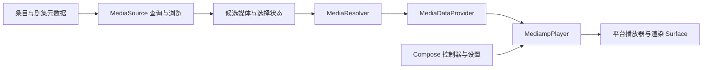

# Animeko 播放器与 bili-sync 配置实践核验

核验日期：2026-10-04。用于 Treasure Up 的播放器体验改造与后续平台规划。

本次只读克隆并检查公开源码、构建文件、最近提交和公开 Issue；未执行外部项目代码，未安装 Animeko 客户端，未测试 Android、iOS、TV、桌面安装包或真实 B 站账号。以下平台结论是源码证据，不是本机兼容性认证。

## 核验快照

| 项目 | 固定源码提交 | 检查范围 |
| --- | --- | --- |
| Animeko | [`c173844ab5fab4a04fea2e31289f4be3fad56453`](https://github.com/open-ani/animeko/tree/c173844ab5fab4a04fea2e31289f4be3fad56453) | datasource API、资源解析器、播放器 UI/平台工厂、弹幕参数、发布工作流、近期播放器提交 |
| bili-sync | [`c900777e78796653fdfb00421879b6a802d1eedd`](https://github.com/amtoaer/bili-sync/tree/c900777e78796653fdfb00421879b6a802d1eedd) | Svelte 设置页、视频筛选配置组件、加载/保存/错误处理 |

克隆均来自作者 GitHub 仓库。补取 Animeko 最近历史时远程 main 已前进到 `8e3c899`，本报告仍以已读取的 `c173844` 工作树为准。没有将变动中的 main 链接冒充固定结论。Animeko 为 AGPL-3.0，bili-sync 为 MIT；本轮借鉴边界和交互原则，未复制其实现代码或素材。

## Animeko 的实际边界

数据源负责列出候选媒体，有稳定 `mediaSourceId` / `mediaId`，支持自动匹配与人工浏览。下载、缓存与播放不在数据源接口内。源码注释仍出现旧名 `VideoSourceResolver`，实际实现目录已使用 `MediaResolver`，不应按旧注释推导当前类名。[MediaSource](https://github.com/open-ani/animeko/blob/c173844ab5fab4a04fea2e31289f4be3fad56453/datasource/api/src/commonMain/kotlin/source/MediaSource.kt)、[MediaResolver](https://github.com/open-ani/animeko/blob/c173844ab5fab4a04fea2e31289f4be3fad56453/app/shared/app-data/src/commonMain/kotlin/domain/media/resolver/MediaResolver.kt)。

HTTP、本地文件、Torrent 分别有解析器。HTTP 解析器提供 URI、请求头及附加文件，最终交给播放器；UI 不直接承担来源探测与字节获取。Treasure Up 可以保持相同的责任划分：服务端发放已授权播放会话，`routing.ts` 处理存储节点，`mediaAdapter.ts` 处理 HLS/文件装载，播放器组件只组织播放状态与控件。[HTTP 解析器](https://github.com/open-ani/animeko/blob/c173844ab5fab4a04fea2e31289f4be3fad56453/app/shared/app-data/src/commonMain/kotlin/domain/media/resolver/HttpStreamingMediaResolver.kt)。

### 平台并非相同内核

共享 `VideoPlayer` 是接收 `MediampPlayer` 的 `expect` 显示函数，不包含控制栏；各平台用 `actual` 实现。平台 API 和 UI 状态可以共享，解码、缓冲、窗口、触摸行为仍要分别实现与测试。[共享 VideoPlayer](https://github.com/open-ani/animeko/blob/c173844ab5fab4a04fea2e31289f4be3fad56453/app/shared/video-player/src/commonMain/kotlin/ui/VideoPlayer.kt)。

| 平台 | 本快照证据 | 对本项目的含义 |
| --- | --- | --- |
| Android | Media3 / ExoPlayer，包含 HLS、DASH 依赖 | 原生客户端可以拓展能力，但不是把网页套壳后自然获得 |
| 桌面 | 实际 `VideoPlayer.desktop.kt` 只接收 mpv；桌面构建按 Windows x64/ARM64、Linux x64、macOS x64/ARM64 选择 runtime | 每个包的原生依赖、加载与发布都要验证 |
| iOS | AVKit 工厂配置 AVFoundation 预读 | iOS 能力受系统播放器约束，不能承诺与桌面一致 |

证据：[播放器依赖](https://github.com/open-ani/animeko/blob/c173844ab5fab4a04fea2e31289f4be3fad56453/app/shared/video-player/build.gradle.kts)、[桌面实际 Surface](https://github.com/open-ani/animeko/blob/c173844ab5fab4a04fea2e31289f4be3fad56453/app/shared/video-player/src/desktopMain/kotlin/ui/VideoPlayer.desktop.kt)、[桌面 runtime 打包](https://github.com/open-ani/animeko/blob/c173844ab5fab4a04fea2e31289f4be3fad56453/app/desktop/build.gradle.kts)、[AVKit 工厂](https://github.com/open-ani/animeko/blob/c173844ab5fab4a04fea2e31289f4be3fad56453/app/shared/video-player/src/iosMain/kotlin/player/AniAVKitMediampPlayerFactory.kt)。

README 的 PC/VLC 表述，以及播放器 Gradle 内“macOS x64 使用 VLC”的注释，均与上述实际桌面实现、runtime 依赖不一致。本报告以可执行实现与依赖声明为准，不能仅引用 README。

统一缓冲策略也只是共同意图：Android 可以按时长控制前后缓存；mpv 的后向缓存用字节限额近似；iOS 后向缓存由系统掌控。Treasure Up 当前 HLS.js 参数不应解释成所有浏览器完全一致的缓冲行为，更不应宣称无重编码分片降低了整集原码率流量。[PlayerBufferPolicy](https://github.com/open-ani/animeko/blob/c173844ab5fab4a04fea2e31289f4be3fad56453/app/shared/video-player/src/commonMain/kotlin/player/PlayerBufferPolicy.kt)。

### 可借鉴的播放器交互

- 控制器显隐、播放器焦点、文字输入焦点是独立状态，文字编辑结束后按意图恢复焦点；这避免输入字体名时空格或方向键意外控制视频。[PlayerControllerState](https://github.com/open-ani/animeko/blob/c173844ab5fab4a04fea2e31289f4be3fad56453/app/shared/video-player/src/commonMain/kotlin/ui/PlayerControllerState.kt)。
- 设置采用播放器侧面板，背景贴边，内容单独避开安全区域；控制的范围集中声明，触摸、桌面和 TV 复用同一参数语义。[设置侧栏](https://github.com/open-ani/animeko/blob/c173844ab5fab4a04fea2e31289f4be3fad56453/app/shared/src/commonMain/kotlin/ui/subject/episode/video/settings/EpisodeVideoSettingsSideSheet.kt)、[弹幕范围](https://github.com/open-ani/animeko/blob/c173844ab5fab4a04fea2e31289f4be3fad56453/danmaku/ui-config/src/commonMain/kotlin/DanmakuConfigRanges.kt)。

本轮没有移植 Animeko 的弹幕服务、匹配、语义过滤或模型；只保留本地显示偏好和原始归档弹幕。

## 发布工作流与现实问题

`release.yml` 由 Kotlin DSL 生成，包含生成一致性检查；`v*` 标签触发后创建草稿 Release，再由不同 runner 构建/上传 Windows、macOS、Linux 以及 Android/iOS 相关产物。工作流中可见 Android 手机与 TV APK、桌面安装包、Linux AppImage 的独立产物。此处验证的是工作流声明，未检查某次运行是否全部成功，也未触发发布。[release.yml](https://github.com/open-ani/animeko/blob/c173844ab5fab4a04fea2e31289f4be3fad56453/.github/workflows/release.yml)。

构建文档明确区分 Android default/TV flavor、需要显式启用的 iOS 构建，以及只能在相应系统构建的桌面包。这意味着多平台目标包含构建、签名、运行库、更新和输入适配成本，不等于共享 UI 后一次构建到处运行。[构建文档](https://github.com/open-ani/animeko/blob/c173844ab5fab4a04fea2e31289f4be3fad56453/docs/contributing/building.md)。

| 记录 | 核验到的内容 | 本轮采用的工程约束 |
| --- | --- | --- |
| [PR #3508](https://github.com/open-ani/animeko/pull/3508) / [提交 ef1e30d](https://github.com/open-ani/animeko/commit/ef1e30d075c04fc951728ef11ea0a98e8f835e89)，2026-10-01 | 本地提交说明和文件变更列表记录全屏/画中画/宽窄布局变换保持播放器节点，避免 Surface 重建 | 网页全屏只移动现有 Artplayer 根；设置始终挂在这个根上，不因布局变化重建视频 |
| [PR #3480](https://github.com/open-ani/animeko/pull/3480) / [提交 6b3ca8a](https://github.com/open-ani/animeko/commit/6b3ca8adb0b880b726750804d6f6b19e54cd7832)，2026-09-29 | 本地提交记录将弹幕来源和时间校准放入播放器设置并复用组件 | 弹幕偏移属于播放器设置，不另在页面堆叠按钮；本项目不增加外部弹幕源 |
| [Issue #3263](https://github.com/open-ani/animeko/issues/3263) | 报告者描述 Windows 6.0.0 原生 runtime classpath 与系统 DLL 校验失败；读取时网页显示 Open | 将“包构建完成”和“目标系统实际可播放”分开验证；不据此声称当前版本仍有同样缺陷 |
| [Issue #1688](https://github.com/open-ani/animeko/issues/1688) | 历史 Windows 全屏边缘未填满报告，网页显示 Closed | 实测进出全屏、恢复原布局、手机旋转与面板边界，不只检查全屏入口 |

PR 网页抓取未成功，GitHub 未认证 API 也返回限流，因此没有独立核验 PR 审核讨论或 API 的合并状态。表中 PR 关联来自已进入所核验历史的提交记录，不能扩张为完整 PR 评审结论。

## bili-sync 前端配置的可借鉴处

其设置页将基础、认证、视频处理、弹幕渲染、通知和高级项分为标签；加载态、保存态与错误反馈独立管理，保存后使用服务端响应替换表单。请求频率有独立启用开关；从属输入随开关显示/禁用；单位在标签或说明中明确。Treasure Up 应沿用这些交互原则，但使用自己的后端键与校验范围，不能直接套用它的并发默认值。[设置页](https://github.com/amtoaer/bili-sync/blob/c900777e78796653fdfb00421879b6a802d1eedd/web/src/routes/settings/+page.svelte)。

视频处理组件用上下限选项与可上移/下移的编码偏好顺序表达选择策略，避免让用户记住质量数字；杜比、HDR、Hi-Res 是独立选项。[FilterOptionEditor](https://github.com/amtoaer/bili-sync/blob/c900777e78796653fdfb00421879b6a802d1eedd/web/src/lib/components/filter-option-editor.svelte)。本轮先将播放器版本显示为“画质 + 原档/兼容副本”，在折叠媒体信息中提供编码/HDR/杜比事实，来源采集策略由后台模块管理。

需区别：bili-sync 这里的弹幕渲染配置针对其归档/ASS 处理路径，不能把字体或透明度数值原样套给 Artplayer。Treasure Up 统一以透明度百分比、字号 px、显示区域百分比、时间偏移秒表示，并在 UI、存储校验与插件适配之间转换。其设置页的浅拷贝和认证方式没有作为本项目实现模板；本项目继续使用自身会话与服务端权限校验。

## Treasure Up 本轮落地与验证范围

实现分层：`ArchivePlayer.vue` 保留播放/恢复/进度；`player/controls.ts` 管理焦点范围内的键盘和可访问入口；`PlayerSettingsPanel.vue` 管理内嵌面板、焦点循环与关闭；`PlaybackOptions.vue` 与 `DanmakuSettings.vue` 分组；`player/preferences.ts` 校验浏览器偏好。`routing.ts` 和 `mediaAdapter.ts` 的既有 HLS、节点与单次重试链路继续使用。

设置始终 Teleport 到实际播放器根，全屏时不依赖已离开的页面祖先样式。小屏保留播放、进度、弹幕、设置和网页全屏；音量等完整控制在面板内。没有 DOM 元素全屏 API 的浏览器使用网页全屏，避免进入只包含 video 的系统界面后丢失自定义控件。原生画中画由浏览器管理，不承诺显示 HTML 弹幕面板。

已运行偏好回归：损坏/旧版 localStorage、数值越界/非法枚举、固定比例密度抽样，3 项通过。已运行 Vue/TypeScript 检查与 Vite 生产构建。屏幕阅读器、Safari/iOS 实机、Android 真机和全部视频编码兼容性尚未验证；真实站点浏览器验收由整合任务继续执行，不能用构建通过替代这些结果。
